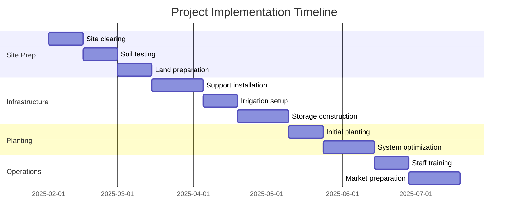
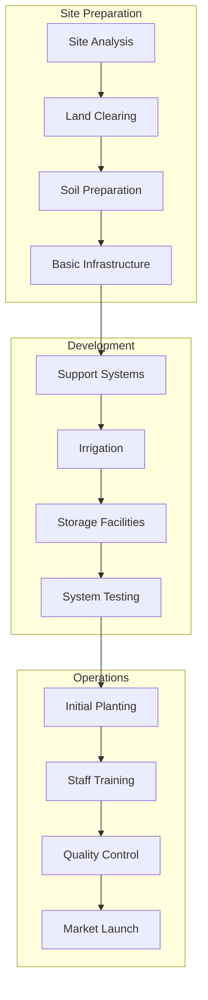

# 7. IMPLEMENTATION TIMELINE AND MILESTONES

## 7.1 Project Phases Overview

### Phase 1: Site Preparation (Months 1-2)
| **Week** | **Activity**           | **Resources**            | **Deliverables**     | **Budget (ZAR)** |
|----------|------------------------|--------------------------|----------------------|------------------|
| 1-2      | Site clearing          | Labor team, equipment    | Cleared area         | R2,500           |
| 3-4      | Soil testing           | Lab services             | Soil analysis report | R1,200           |
| 5-6      | Land preparation       | Machinery, amendments    | Prepared beds        | R3,500           |
| 7-8      | Infrastructure setup   | Construction team        | Basic structures     | R4,800           |

### Phase 2: Infrastructure Development (Months 2-3)
| **Week** | **Activity**              | **Resources**      | **Deliverables**        | **Budget (ZAR)** |
|----------|---------------------------|--------------------|-------------------------|------------------|
| 9-10     | Support system installation | Materials, labor   | Support framework       | R5,200           |
| 11-12    | Irrigation setup          | System components  | Working irrigation      | R4,300           |
| 13-14    | Storage area construction | Building materials | Storage facility        | R6,500           |
| 15-16    | System testing            | Technical team     | Test reports            | R1,800           |

---

## 7.2 Critical Path Activities

### Gantt Chart Overview

---

## 7.3 Resource Allocation Schedule

### Human Resources
| **Phase**     | **Role**               | **Hours/Week** | **Duration** | **Cost/Month (ZAR)** |
|---------------|------------------------|----------------|--------------|-----------------------|
| Setup         | Project Manager        | 20             | 3 months     | R8,000               |
| Construction  | Skilled Labor          | 40             | 2 months     | R12,000              |
| Planting      | Agriculture Specialist | 30             | 1 month      | R6,000               |
| Training      | Operations Manager     | 25             | 2 months     | R7,000               |

---

## 7.4 Key Milestones and Deliverables

### Quarter 1 (Feb-Apr 2025)
- [x] Site preparation completed
- [x] Infrastructure installed
- [x] Irrigation system operational
- [x] Storage facility ready

### Quarter 2 (May-Jul 2025)
- [ ] Initial planting completed
- [ ] Staff training finished
- [ ] Quality systems implemented
- [ ] Market connections established

---

## 7.5 Budget Flow Timeline

### Investment Schedule
| **Month** | **Category**        | **Allocation (ZAR)** | **Cumulative (ZAR)** |
|-----------|---------------------|----------------------|----------------------|
| 1         | Site Prep           | R7,200              | R7,200               |
| 2         | Infrastructure      | R16,500             | R23,700              |
| 3         | Planting            | R8,000              | R31,700              |
| 4         | Operations          | R5,000              | R36,700              |

---

## 7.6 Quality Control Checkpoints

### Implementation Quality Gates
| **Milestone**      | **Quality Criteria**      | **Verification Method**   | **Sign-off Required**      |
|--------------------|--------------------------|---------------------------|----------------------------|
| Site Prep          | Soil pH 6.0-6.5         | Lab testing               | Agronomist                |
| Infrastructure     | Load bearing tests      | Engineering inspection    | Project Manager           |
| Planting           | Plant health            | Visual inspection         | Agriculture Specialist    |
| Operations         | System efficiency       | Performance metrics       | Operations Manager        |

---

## 7.7 Risk Management Timeline

### Monitoring Schedule
| **Activity**       | **Frequency**  | **Responsible** | **Reporting To**       |
|--------------------|----------------|-----------------|------------------------|
| Site Inspection    | Daily          | Site Manager    | Project Manager        |
| Quality Checks     | Weekly         | QC Officer      | Operations Manager     |
| Financial Review   | Monthly        | Accountant      | Project Manager        |
| Progress Report    | Monthly        | Project Manager | Stakeholders           |

### Process Diagram

---

[Previous](risk-management.md) | [Next](appendices.md)
