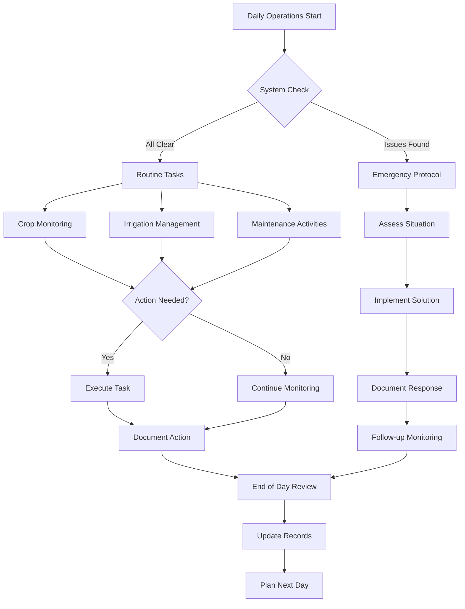

# OPERATIONS MANUAL TEMPLATE

## Instructions

This operations manual template helps you develop standard operating procedures (SOPs) for your agricultural operation. Customize each section based on your specific crops, scale, equipment, and local conditions. Establish routines that ensure consistent quality, efficient resource use, and systematic record-keeping.

---

## 4.1 Daily Operations Schedule Template

### Daily Task Framework

**Create a schedule appropriate for your crops and season. Adjust timing based on climate and daylight hours.**

#### Morning Routine ([Time] - [Time])

**System Checks:**

- [ ] Inspect irrigation system for leaks or malfunctions
- [ ] Check water pressure and flow rates
- [ ] Review automated system alerts/logs
- [ ] Verify pest monitoring traps
- [ ] Document weather conditions
- [ ] [Add crop-specific checks]

**Crop Health Monitoring:**

- [ ] Visual inspection of [Crop 1]
- [ ] Visual inspection of [Crop 2]
- [ ] Check for pest/disease symptoms
- [ ] Monitor growth stage and development
- [ ] Assess water stress indicators
- [ ] Document any issues or changes
- [ ] [Add specific monitoring tasks]

**Priority Tasks:**

- [ ] [Urgent maintenance or treatments]
- [ ] [Harvest if needed]
- [ ] [Scheduled applications]
- [ ] [Other time-sensitive activities]

#### Midday Routine ([Time] - [Time])

**Production Activities:**

- [ ] [Harvest activities if applicable]
- [ ] [Pruning/training tasks]
- [ ] [Planting/transplanting]
- [ ] [Fertilizer/amendment applications]
- [ ] [Pest/disease treatments]
- [ ] [Equipment maintenance]
- [ ] [Add specific tasks]

**Quality Control:**

- [ ] Sort and grade harvested product
- [ ] Check product quality standards
- [ ] Proper storage of produce
- [ ] Clean and sanitize equipment
- [ ] Update harvest records

#### Afternoon/Evening Routine ([Time] - [Time])

**Environmental Management:**

- [ ] Adjust irrigation schedule if needed
- [ ] Monitor temperature extremes
- [ ] Check weather forecast for next 24-48 hours
- [ ] Adjust shade/ventilation systems
- [ ] Prepare frost/heat protection if needed
- [ ] [Add climate-specific tasks]

**Administrative Tasks:**

- [ ] Update daily log and records
- [ ] Review and plan next day's tasks
- [ ] Document any issues or observations
- [ ] Update inventory of supplies
- [ ] Communicate with team/supervisor
- [ ] [Add reporting requirements]

---

## 4.2 Weekly and Monthly Maintenance Schedule

### Weekly Task Schedule Template

**Customize this schedule for your operation:**

| Day       | Routine Tasks    | Periodic Tasks                                     | Responsible Person |
| --------- | ---------------- | -------------------------------------------------- | ------------------ |
| Monday    | [Daily routines] | Detailed system inspection, equipment checks       | [Name/Role]        |
| Tuesday   | [Daily routines] | Pest monitoring, trap checks, scouting             | [Name/Role]        |
| Wednesday | [Daily routines] | Soil testing, nutrient applications (as scheduled) | [Name/Role]        |
| Thursday  | [Daily routines] | Pruning, training, crop maintenance                | [Name/Role]        |
| Friday    | [Daily routines] | Deep irrigation system check, filter cleaning      | [Name/Role]        |
| Saturday  | [Daily routines] | Equipment maintenance, tool sharpening             | [Name/Role]        |
| Sunday    | [Minimal tasks]  | Data review, planning for next week                | [Name/Role]        |

### Weekly Maintenance Checklist

**Infrastructure:**

- [ ] Inspect all support structures for damage
- [ ] Check fence integrity and gates
- [ ] Examine buildings for maintenance needs
- [ ] Review drainage systems
- [ ] Test backup systems

**Irrigation:**

- [ ] Clean filters thoroughly
- [ ] Check for clogged emitters
- [ ] Verify pump operation and pressure
- [ ] Inspect pipes and fittings for leaks
- [ ] Test automated controls and sensors

**Equipment:**

- [ ] Check all tools for damage or wear
- [ ] Sharpen cutting tools
- [ ] Lubricate moving parts
- [ ] Inspect safety equipment
- [ ] Clean and organize storage areas

**Crops:**

- [ ] Comprehensive pest and disease survey
- [ ] Growth stage assessment for each crop
- [ ] Weed pressure evaluation
- [ ] Nutrient deficiency checks
- [ ] Yield projections update

### Monthly Task Schedule

**Maintenance Activities:**

- [ ] Deep cleaning of all equipment
- [ ] Major system inspections (irrigation, electrical)
- [ ] Structural integrity assessment
- [ ] Comprehensive pest/disease survey
- [ ] Soil testing (as appropriate for crop cycle)
- [ ] Update maintenance logs

**Administrative:**

- [ ] Financial review and reconciliation
- [ ] Inventory of supplies and inputs
- [ ] Review and update production records
- [ ] Marketing and sales planning
- [ ] Staff review and training needs
- [ ] Safety and compliance audit

---

## 4.3 Crop-Specific Production Protocols

### Growing Protocol Template

**Complete for each major crop:**

**Crop Name: [Your Crop]**

#### Stage 1: Establishment (Weeks/Months [X-Y])

**Planting/Transplanting:**

- Spacing: [Distance]
- Depth: [Depth]
- Timing: [Season/conditions]
- Method: [Direct seed/transplant/cutting]

**Initial Care:**

- Watering frequency: [Schedule]
- Fertilization: [Type, rate, frequency]
- Protection: [Mulch, shade, row covers]
- Monitoring: [Key indicators]

**Expected Outcomes:**

- Survival rate target: [%]
- Growth milestones: [Measurements]
- Time to next stage: [Duration]

#### Stage 2: Vegetative Growth (Weeks/Months [X-Y])

**Training and Maintenance:**

- Pruning schedule: [Frequency, method]
- Training method: [Technique]
- Support needs: [When and how]
- Spacing adjustments: [If needed]

**Nutrition Management:**

- Fertilizer type: [NPK ratio or specific product]
- Application rate: [Amount per plant]
- Frequency: [Schedule]
- Foliar feeding: [If applicable]

**Irrigation:**

- Water volume: [L per plant or per m²]
- Frequency: [Times per day/week]
- Adjustments: [Weather-based modifications]

**Expected Outcomes:**

- Growth targets: [Height, spread, leaf count]
- Time to flowering/production: [Duration]

#### Stage 3: Reproductive/Production (Weeks/Months [X-Y])

**Crop Management:**

- Pruning adjustments: [Modified approach]
- Thinning: [If needed, when, how much]
- Support maintenance: [Ongoing needs]
- Stress management: [Heat, water, load]

**Nutrition:**

- Adjusted fertilizer: [New NPK ratio]
- Application rate: [Amount]
- Frequency: [Schedule]
- Special amendments: [Calcium, micronutrients, etc.]

**Pest/Disease Focus:**

- Critical monitoring points: [What to watch]
- Preventive measures: [Routine applications]
- Threshold levels: [Action triggers]

**Expected Outcomes:**

- First harvest date: [Approximate timing]
- Yield target: [Amount per plant/area]
- Quality expectations: [Grade standards]

#### Stage 4: Harvest and Post-Harvest

**Harvest Indicators:**

- Maturity signs: [Visual, physical, measured]
- Optimal timing: [Time of day, weather]
- Quality criteria: [Size, color, firmness, brix, etc.]

**Harvest Method:**

- Technique: [Cut, pull, twist, etc.]
- Tools needed: [List]
- Container type: [Boxes, bins, bags]
- Handling care: [Bruising prevention]

**Post-Harvest Handling:**

- Initial sorting: [Quality grades]
- Cleaning: [Method if applicable]
- Cooling: [Temperature, method]
- Storage conditions: [Temperature, humidity, duration]
- Packaging: [Type, labeling]

**Expected Yields:**

- Per plant: [Amount]
- Per unit area: [Amount per hectare/acre]
- Harvest frequency: [Days between pickings]
- Season duration: [Length of harvest period]

---

## 4.4 Irrigation Management Protocols

### Irrigation Schedule Framework

**Create schedules for each crop and season:**

**Crop: [Your Crop Name]**

| Season   | Growth Stage  | Frequency | Duration/Volume | Timing        | Adjustments     |
| -------- | ------------- | --------- | --------------- | ------------- | --------------- |
| [Season] | Establishment | [Per day] | [Minutes or L]  | [Time of day] | [Weather-based] |
| [Season] | Vegetative    | [Per day] | [Minutes or L]  | [Time of day] | [Weather-based] |
| [Season] | Production    | [Per day] | [Minutes or L]  | [Time of day] | [Weather-based] |

### Water Management Guidelines

**Monitoring Indicators:**

- Soil moisture: [Target range, measurement method]
- Visual plant indicators: [Leaf color, turgor, wilting point]
- Weather factors: [Temperature, humidity, wind, rainfall]
- Growth stage needs: [Variations by stage]

**Decision Rules:**

- Increase watering when: [Conditions]
- Decrease watering when: [Conditions]
- Adjust timing if: [Situations]
- Emergency response: [Extreme heat, drought, excess rain]

**Water Quality Considerations:**

- pH: [Target range]
- EC (electrical conductivity): [Target range]
- Testing frequency: [Schedule]
- Treatment needed: [Filtration, pH adjustment, etc.]

---

## 4.5 Pest and Disease Management

### Integrated Pest Management (IPM) Protocol

**Prevention First Approach:**

1. **Cultural Practices**
   - Crop rotation: [Schedule and plan]
   - Sanitation: [Remove dead material, clean tools]
   - Resistant varieties: [Select appropriate cultivars]
   - Proper spacing: [Ensure air circulation]
   - Balanced nutrition: [Avoid excess nitrogen]

2. **Monitoring Schedule**
   - Daily visual inspection: [Quick walk-through]
   - Weekly detailed scouting: [Systematic survey]
   - Trap monitoring: [Pheromone, sticky traps]
   - Record keeping: [Document findings]

3. **Threshold Levels**
   - Document action thresholds for each pest
   - Economic thresholds for treatment decisions
   - Beneficial insect presence
   - Disease incidence levels

### Pest and Disease Treatment Matrix

**Template for each crop:**

**Crop: [Your Crop Name]**

| Issue          | Symptoms      | Prevention             | Treatment Options          | Application Timing | Notes                    |
| -------------- | ------------- | ---------------------- | -------------------------- | ------------------ | ------------------------ |
| [Pest 1]       | [Description] | [Cultural practices]   | [Organic/chemical options] | [When to apply]    | [PHI, REI, restrictions] |
| [Pest 2]       | [Description] | [Cultural practices]   | [Treatment options]        | [When to apply]    | [Safety info]            |
| [Disease 1]    | [Description] | [Prevention methods]   | [Treatment options]        | [When to apply]    | [Application notes]      |
| [Disease 2]    | [Description] | [Prevention methods]   | [Treatment options]        | [When to apply]    | [Safety info]            |
| [Deficiency 1] | [Symptoms]    | [Nutrition management] | [Corrective treatment]     | [When to apply]    | [Follow-up]              |

**Treatment Application Records:**

- Product used: [Name, active ingredient]
- Rate: [Amount per area or plant]
- Method: [Spray, drench, granular]
- Area treated: [Specific zones]
- Applicator: [Name]
- Weather conditions: [Temperature, wind, rain forecast]
- Pre-harvest interval: [Days until harvest allowed]
- Re-entry interval: [Hours until safe entry]

---

## 4.6 Harvest and Post-Harvest Operations

### Harvest Planning

**Pre-Harvest Checklist:**

- [ ] Harvest containers cleaned and ready
- [ ] Grading/sorting area prepared
- [ ] Packaging materials available
- [ ] Storage area ready (proper temperature)
- [ ] Transportation arranged
- [ ] Labor scheduled
- [ ] Tools cleaned and sharpened
- [ ] Buyers confirmed
- [ ] Compliance with pre-harvest intervals for any treatments

### Harvest Standard Operating Procedures

**For each crop, document:**

**Crop: [Your Crop Name]**

#### Harvest Criteria

- **Maturity Indicators**: [Color, size, firmness, brix, days from flowering]
- **Optimal Time**: [Morning/afternoon, weather conditions]
- **Equipment Needed**: [Knives, clippers, bins, gloves]

#### Harvest Technique

1. [Step-by-step harvest procedure]
2. [Handling specifications]
3. [Quality selection criteria]
4. [Field culling procedures]

#### Quality Grades

| Grade              | Criteria         | Price Point        | Market Channel |
| ------------------ | ---------------- | ------------------ | -------------- |
| Premium/Grade A    | [Specifications] | [Price]            | [Market]       |
| Standard/Grade B   | [Specifications] | [Price]            | [Market]       |
| Processing/Grade C | [Specifications] | [Price]            | [Market]       |
| Reject             | [Criteria]       | [Disposal/compost] | N/A            |

### Post-Harvest Handling Protocol

**Immediate Steps After Harvest:**

1. Move to shade/cool area within [X] minutes
2. Initial sorting and grading
3. Gentle cleaning if needed (method: [describe])
4. Cooling to optimal temperature: [Temperature]
5. Storage in proper conditions

**Packaging Standards:**

- Container type: [Material, size]
- Quantity per container: [Weight or count]
- Labeling requirements: [Farm name, date, grade, etc.]
- Stacking method: [To prevent damage]

**Storage Conditions:**

- Temperature: [Range]
- Humidity: [Range]
- Ventilation: [Requirements]
- Maximum storage duration: [Time]
- Monitoring frequency: [Daily checks]

---

## 4.7 Quality Control and Record Keeping

### Quality Control Checkpoints

**Daily Quality Metrics:**

| Parameter       | Target Range   | Measurement Method   | Frequency       | Action if Out of Range |
| --------------- | -------------- | -------------------- | --------------- | ---------------------- |
| Soil moisture   | [% or reading] | [Sensor/manual]      | [Times per day] | [Adjust irrigation]    |
| Temperature     | [Range]        | [Thermometer/sensor] | [Frequency]     | [Shade/ventilation]    |
| Humidity        | [Range]        | [Sensor/hygrometer]  | [Frequency]     | [Adjust environment]   |
| pH              | [Range]        | [Meter/test kit]     | [Weekly]        | [Amend soil/water]     |
| EC              | [Range]        | [Meter]              | [Weekly]        | [Adjust fertilization] |
| [Crop-specific] | [Target]       | [Method]             | [Frequency]     | [Response]             |

### Production Record Keeping

**Essential Records to Maintain:**

1. **Planting Records**
   - Date planted
   - Variety/cultivar
   - Source of plants/seeds
   - Location (field/zone)
   - Quantity
   - Expected first harvest date

2. **Input Application Records**
   - Date and time
   - Product name and type
   - Rate applied
   - Application method
   - Area/crops treated
   - Weather conditions
   - Applicator name
   - Reason for application

3. **Harvest Records**
   - Date
   - Crop/variety
   - Area harvested
   - Quantity by grade
   - Weather conditions
   - Labor hours
   - Issues or notes

4. **Sales Records**
   - Date
   - Product and quantity
   - Buyer information
   - Price received
   - Delivery details
   - Payment terms

5. **Maintenance Records**
   - Equipment servicing
   - Repairs completed
   - Parts replaced
   - System upgrades
   - Cost of maintenance

6. **Financial Records**
   - Income
   - Expenses by category
   - Invoices and receipts
   - Bank statements
   - Tax documents

### Data Analysis and Improvement

**Monthly Review:**

- Compare actual vs. projected yields
- Analyze input costs per unit produced
- Review labor efficiency
- Assess quality rates
- Identify problem areas
- Plan improvements

---

## 4.8 Emergency Procedures and Contingencies

### Weather-Related Emergencies

#### Frost Protection Protocol

**Warning Indicators:**

- Temperature forecast below [X]°C
- Clear skies and low humidity
- Calm wind conditions

**Response Actions:**

1. [Activate overhead irrigation if available]
2. [Deploy frost cloth/covers]
3. [Increase soil moisture before event]
4. [Use heaters/smudge pots if applicable]
5. [Monitor temperature throughout night]
6. [Document damage after event]

#### Heat Wave Protocol

**Warning Indicators:**

- Forecast temperatures above [X]°C
- High UV index
- Low humidity

**Response Actions:**

1. [Increase irrigation frequency]
2. [Deploy shade structures]
3. [Apply protective foliar sprays]
4. [Mist foliage if appropriate]
5. [Delay harvest if possible]
6. [Monitor twice daily]

#### Storm/High Wind Preparedness

**Actions 24-48 Hours Before:**

- [ ] Secure loose equipment and materials
- [ ] Harvest ripe produce if possible
- [ ] Check and secure support structures
- [ ] Clear drainage channels
- [ ] Document pre-storm condition
- [ ] Prepare emergency repair supplies

**Post-Storm Assessment:**

- [ ] Safety check before entering affected areas
- [ ] Document all damage (photos)
- [ ] Priority repairs for urgent issues
- [ ] Contact insurance if applicable
- [ ] Assess crop losses
- [ ] Update production projections

### System Failure Responses

#### Irrigation System Failure

**Immediate Actions:**

1. Switch to manual watering system
2. Prioritize high-value or stressed crops
3. Check electrical supply and controls
4. Inspect for obvious leaks or breaks
5. Contact repair service if beyond capabilities
6. Document incident and response

**Backup Water Sources:**

- [List alternative water sources]
- [Manual watering capacity]
- [Equipment needed for manual watering]

#### Power Outage

**Actions:**

- [ ] Switch to backup power if available
- [ ] Manually operate critical systems
- [ ] Assess duration estimate
- [ ] Prioritize critical operations
- [ ] Adjust work schedule if needed
- [ ] Monitor perishable products

### Pest or Disease Outbreak

**Crisis Response:**

1. Isolate affected area immediately
2. Conduct thorough identification (get expert help if needed)
3. Assess extent of problem
4. Research treatment options
5. Implement immediate control measures
6. Increase monitoring frequency
7. Document outbreak and response
8. Review prevention practices

### Equipment Breakdown

**Response Protocol:**

1. Safety first - secure area
2. Assess problem and urgency
3. Attempt field repair if possible
4. Contact repair service if needed
5. Use backup equipment or rent replacement
6. Adjust operations schedule
7. Document for maintenance records

---

## 4.9 Workflow Visualization

### Standard Operations Flow

### Harvest Operations Flow

---

## Operations Manual Development Checklist

Use this checklist to complete your operations manual:

- [ ] Documented all daily routines for each season
- [ ] Created weekly and monthly task schedules
- [ ] Developed crop-specific growing protocols
- [ ] Established irrigation management guidelines
- [ ] Created pest and disease management plans
- [ ] Documented harvest and post-harvest procedures
- [ ] Set up quality control systems
- [ ] Designed record-keeping templates
- [ ] Created emergency response protocols
- [ ] Trained all staff on standard procedures
- [ ] Made procedures easily accessible (posted, binders, digital)
- [ ] Set schedule for regular review and updates
- [ ] Integrated feedback mechanism for improvements

---

## 4.8 Fertility Management and Soil Monitoring

### Soil Sampling Schedule

**Annual Soil Testing (Every Crop Year):**

| Test Type | Depth | Parameters | Timing | Action |
|-----------|-------|------------|--------|--------|
| Standard Profile | 0-6" | pH, P, K, Zn, OM, CEC | Before planting season | Adjust fertility plan |
| Nitrate Profile | 0-24" | Nitrate-N, Sulfate-S | Before planting season | Set N rates |
| Deep Sampling | 2-4 ft | Nitrate-N | Before deep-rooted crops (sunflower) | Quantify deep N reserves |

**Sampling Method:**
- [ ] Use zone or grid sampling pattern
- [ ] Maintain consistent sampling locations year-to-year
- [ ] Send to certified lab within 24 hours
- [ ] Record GPS coordinates of sample points
- [ ] File results systematically by field and date

### In-Season Tissue Testing Schedule

**Crop-Specific Monitoring:**

#### Potato

- **Sample Type:** Petiole NO₃
- **Frequency:** Weekly from tuber initiation through bulking
- **Target Range:** 13,000-15,000 ppm NO₃-N
- **Action:** Adjust fertigation to maintain range
- **Record:** Date, growth stage, reading, action taken

#### Beetroot

- **Sample Type:** Leaf tissue + visual inspection
- **Monitor For:** Boron deficiency symptoms
- **Symptoms:** Heart rot, black spot, internal browning
- **Action:** Foliar B application only if deficiency confirmed
- **Rate:** Follow label, typically 0.5-1 lb B/ac foliar

#### Sunflower

- **Sample Type:** Visual scouting + tissue if symptoms appear
- **Monitor For:** B and Zn deficiency symptoms
- **Action:** Apply only with documented deficiency
- **Note:** Test first - don't assume response

### Nutrient Application Records

**Required Documentation:**

| Date | Field/Block | Crop | Product | Rate | Method | Cost | Operator | Conditions |
|------|------------|------|---------|------|--------|------|----------|------------|
| [Date] | [ID] | [Crop] | [Fertilizer type] | [lbs/ac] | [Broadcast/Band/Foliar] | [R] | [Name] | [Weather/soil] |

**Application Checklist:**
- [ ] Soil test results reviewed and plan created
- [ ] Products ordered and received
- [ ] Calibrate equipment before application
- [ ] Check weather forecast (no rain for foliar, etc.)
- [ ] Verify correct product and rate
- [ ] Document application immediately after completion
- [ ] Monitor crop response 7-14 days post-application
- [ ] File records for future reference and compliance

### Sufficiency-Based P/K Strategy

**Decision Framework:**

1. **Review Soil Test Results:**
   - [ ] Compare P and K levels to critical thresholds
   - [ ] Identify fields in maintenance vs. build-up ranges

2. **Calculate Removal Rates:**
   - [ ] Use crop-specific removal rates from Fertility Management Guide
   - [ ] Multiply by expected yield to get removal amounts

3. **Determine Application Rates:**
   - **Low Tests (Build-up):** Apply removal rate + build-up (follow soil test recommendations)
   - **Maintenance Range:** Apply removal rate only
   - **High Tests:** Reduce or skip P/K, monitor yield response

4. **Placement Strategy:**
   - [ ] Band P/K 2x2 from seed for salt-sensitive crops
   - [ ] Broadcast for uniform-feeding crops
   - [ ] Keep salt away from seed (sunflower, etc.)

### Nitrogen Management by Crop Transition

**Credit Previous Crop N:**

| Previous Crop | N Credit (lb/ac) | Notes |
|---------------|------------------|-------|
| Legumes (soybean, clover) | 30-45 | Conservative estimate |
| Potato | Variable | Sample residual nitrate 0-24" |
| Sorghum | Minimal to negative | May immobilize N, add 20-40 lb N/ac early for following crop |
| Cover crops (young) | 30-60 | Depends on biomass and termination timing |
| Cover crops (mature) | -20 to 0 | May tie up N temporarily |

**Profile Nitrate Sampling:**
- [ ] Sample to 24" depth before planting
- [ ] Credit all nitrate-N in calculation
- [ ] Adjust applied N rate accordingly
- [ ] Sample deeper (4-6 ft) for deep-rooted crops if practical

### Potassium Source Selection

**Crop-Specific Recommendations:**

| Crop | Preferred Source | Reason | Avoid |
|------|-----------------|--------|-------|
| Potato | K₂SO₄ (SOP) | Maintains quality (SG, fry color) + adds S | Heavy preplant KCl |
| Beetroot | K₂SO₄ or KCl | Either acceptable, watch timing | Heavy salt near young plants |
| Sunflower | KCl acceptable | Economical, but band 2x2 | Salt near seed |
| General | KCl | Most economical | N/A |

**If Using KCl for Economics:**
- [ ] Apply well ahead of critical growth periods
- [ ] Keep away from sensitive root zones
- [ ] Split applications to reduce salt concentration

### Micronutrient Management

**Boron Applications:**

| Crop | Rate (lb B/ac) | Method | Timing | Warning |
|------|----------------|--------|--------|---------|
| Beetroot | 2-3 | Broadcast preplant | Before planting | Narrow safety margin |
| Beetroot (rescue) | 0.5-1 | Foliar | If symptoms appear | Follow label strictly |
| Sunflower | Test first | Only if documented need | Based on local data | Don't assume response |

**Sulfur Applications:**

| Crop | Rate (lb S/ac) | Source | Conditions |
|------|----------------|--------|------------|
| Potato | 15-30 | Sulfate form | Sandy/irrigated soils |
| Sunflower | 15-30 | Sulfate or SOP | Sandy/irrigated soils |
| General | 10-20 | Sulfate | When soil S < 10 ppm |

### pH Management

**Target Ranges by Crop:**

| Crop | Optimal pH | Critical Reason |
|------|-----------|-----------------|
| Beetroot | 6.2-7.0 | Maximize micronutrient availability, prevent B deficiency |
| Potato | 5.5-6.5 | Reduce scab risk while maintaining nutrient availability |
| Legumes | 6.0-7.0 | Optimize nodulation and N fixation |
| General | 6.0-7.0 | Good nutrient availability |

**pH Adjustment:**
- [ ] Test pH annually in every field
- [ ] Apply lime 3-6 months before planting if pH < target
- [ ] Apply sulfur if pH > 7.5 (rare for most areas)
- [ ] Retest after adjustment to confirm correction

### Cover Crop Integration

**Cover Crop Selection by Rotation Window:**

| After Crop | Recommended Cover | Timing | Benefits | Termination |
|-----------|-------------------|--------|----------|-------------|
| Potato | Rye | Immediate post-harvest | Catch leachable N, protect structure | Spring, 2-3 weeks before planting |
| Potato | Rye + Crimson Clover | Immediate post-harvest | N fixation for spring credit | Spring, 2-3 weeks before planting |
| Sunflower | Oat/Rye buffer | Post-harvest | Dilute allelopathy | Before soybean planting |
| General | Sorghum-sudangrass | Summer fallow | Biomass, break compaction | Early, 30+ days before high-N crop |

**Cover Crop Management Checklist:**
- [ ] Select appropriate species for rotation window
- [ ] Plant at recommended rates and timing
- [ ] Monitor establishment and growth
- [ ] Terminate at proper timing (critical for N management)
- [ ] Allow decomposition time before planting cash crop
- [ ] Document biomass and condition at termination

### Disease Management Through Fertility

**White Mold Prevention (Sunflower/Soybean):**
- [ ] Enforce 3-year break between sunflower and soybean
- [ ] Insert cereal buffer crop if needed
- [ ] Use resistant varieties when available
- [ ] Manage canopy density (row spacing, population)
- [ ] Document white mold occurrence by field

### Monthly Fertility Management Checklist

**Pre-Season (2-3 months before planting):**
- [ ] Collect and submit soil samples
- [ ] Review previous year's tissue test results
- [ ] Calculate nutrient removal from last crop
- [ ] Develop fertility plan based on soil tests
- [ ] Order fertilizers and amendments
- [ ] Calibrate application equipment

**Planting Season:**
- [ ] Apply preplant amendments as planned
- [ ] Band starter fertilizers (if applicable)
- [ ] Document all applications
- [ ] Monitor crop emergence and early growth

**Growing Season:**
- [ ] Conduct weekly tissue testing (potato petioles)
- [ ] Scout for nutrient deficiency symptoms
- [ ] Adjust sidedress/fertigation as needed
- [ ] Document in-season applications
- [ ] Monitor crop development stages

**Post-Harvest:**
- [ ] Calculate actual crop removal (yield × removal rates)
- [ ] Update nutrient budget for field
- [ ] Plant cover crops where planned
- [ ] Review season's fertility program effectiveness
- [ ] Plan improvements for next season

---

**Remember:**

- Operations manuals are living documents - update regularly
- Get input from everyone who performs the tasks
- Make procedures as simple and clear as possible
- Use photos or diagrams to illustrate techniques
- Review and revise annually or when practices change
- Train all staff thoroughly on all relevant procedures

[Previous](technical-implementation.md) | [Next](market-strategy.md)
