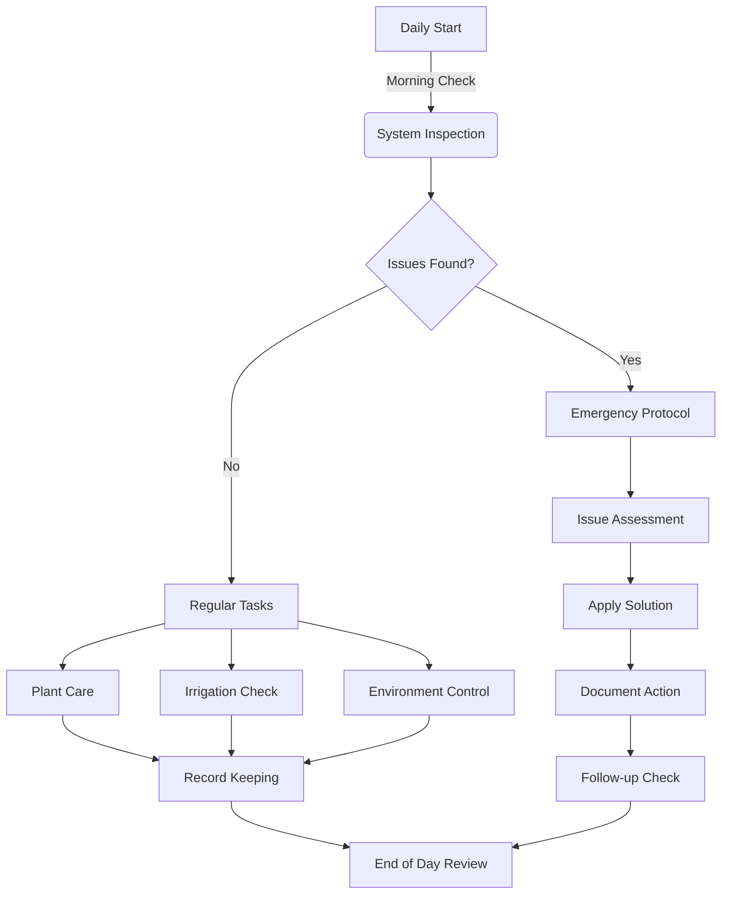

# 4. OPERATIONS MANUAL

## 4.1 Daily Operations Schedule

### Morning Tasks (06:00-08:00)
1. **System Inspection**
   - Check irrigation system functionality
   - Inspect for pest presence
   - Review moisture sensor readings
   - Document any anomalies

2. **Plant Health Check**
   - Visual inspection of foliage
   - Check for new growth
   - Assess fruit development
   - Monitor support structure integrity

### Evening Tasks (16:00-18:00)
1. **Environmental Control**
   - Adjust shade cloth if needed
   - Check temperature readings
   - Record daily measurements
   - Prepare frost protection if needed

## 4.2 Weekly Maintenance Schedule

| Day      | Primary Tasks           | Secondary Tasks      |
|----------|-------------------------|----------------------|
| Monday   | Structural inspection   | Update logs          |
| Tuesday  | Pest monitoring         | Clean tools          |
| Wednesday| Fertilization (if scheduled) | Check storage  |
| Thursday | Pruning/Training        | Organize supplies    |
| Friday   | Deep irrigation check   | Equipment maintenance|
| Saturday | General maintenance     | Market preparation   |
| Sunday   | System rest day         | Data review          |

## 4.3 Growing Protocols

### Plant Training
1. **Initial Training (Months 1-3)**
   - Guide new growth vertically
   - Secure to support structure
   - Remove lateral branches below 30cm
   - Maintain single leader

2. **Secondary Training (Months 4-6)**
   - Direct lateral branches horizontally
   - Space branches 25-30cm apart
   - Remove excessive growth
   - Balance plant structure

### Fertilization Schedule
| Growth Stage  | Product  | Rate       | Frequency       |
|---------------|----------|------------|-----------------|
| Establishment | 3:2:3    | 50g/plant  | Monthly         |
| Vegetative    | 5:1:3    | 75g/plant  | Bi-monthly      |
| Flowering     | 3:1:5    | 100g/plant | Monthly         |
| Fruiting      | 2:3:4    | 125g/plant | Bi-monthly      |

## 4.4 Irrigation Management

### Watering Schedule
| Season        | Frequency | Duration | Time    |
|---------------|-----------|----------|---------|
| Summer        | 2x daily  | 15 min   | 06:00, 17:00 |
| Winter        | 1x daily  | 10 min   | 10:00   |
| Spring/Autumn | 1x daily  | 12 min   | 07:00   |

### Moisture Targets
- Field Capacity: 80-85%
- Wilting Point: 50%
- Optimal Range: 65-75%

## 4.5 Pest and Disease Management

### Prevention Protocol
1. **Regular Monitoring**
   - Daily visual inspection
   - Weekly detailed check
   - Monthly comprehensive survey

2. **Preventive Measures**
   - Maintain air circulation
   - Remove dead material
   - Clean tools between uses
   - Monitor pH levels

### Treatment Matrix
| Issue       | Symptoms              | Treatment         | Prevention          |
|-------------|-----------------------|-------------------|---------------------|
| Stem Rot    | Brown lesions         | Copper fungicide  | Improve drainage    |
| Mealybugs   | White cotton-like masses | Neem oil       | Regular inspection  |
| Sunburn     | Yellow patches        | Shade cloth       | Proper positioning  |
| Root Rot    | Wilting               | Reduce irrigation | Soil amendment      |

## 4.6 Harvest Procedures

### Harvest Criteria
- **Color**: Full red with even tone
- **Size**: 8-12cm length
- **Texture**: Firm but slight give
- **Brix**: 13-15° minimum

### Harvest Steps
1. **Preparation**
   - Sanitize tools
   - Prepare collection containers
   - Set up sorting station
   - Ready packaging materials

2. **Collection Process**
   - Cut stem at 45° angle
   - Leave 2cm stem attached
   - Handle by body, not spines
   - Place in padded containers

3. **Post-Harvest**
   - Grade fruit
   - Clean if necessary
   - Package according to grade
   - Store at 8-10°C

## 4.7 Quality Control

### Daily Quality Metrics
| Parameter       | Target Range     | Action if Outside Range    |
|-----------------|------------------|----------------------------|
| Soil Moisture   | 65-75%          | Adjust irrigation          |
| Temperature     | 20-30°C         | Modify shade/protection    |
| pH              | 6.0-6.5         | Amend soil                 |
| EC              | 1.5-2.0 mS/cm   | Adjust fertilization       |

### Monthly Quality Checks
1. **Plant Health Index**
   - Leaf color (1-5 scale)
   - Growth rate
   - Disease resistance
   - Productivity metrics

2. **Infrastructure**
   - Support structure integrity
   - Irrigation system efficiency
   - Shade system condition
   - Tool maintenance

## 4.8 Emergency Procedures

### Weather Events
1. **Frost Warning**
   - Deploy frost protection
   - Increase soil moisture
   - Reduce fertilization
   - Monitor hourly

2. **Heat Wave**
   - Increase irrigation frequency
   - Deploy additional shade
   - Mist foliage if needed
   - Monitor twice daily

### System Failures
1. **Irrigation Failure**
   - Switch to manual watering
   - Check electrical systems
   - Inspect for blockages
   - Document incident

2. **Structure Damage**
   - Temporary support installation
   - Plant protection measures
   - Document damage
   - Implement repairs

#### Process Workflow

[Previous](financial-analysis.md) | [Next](market-strategy.md)
