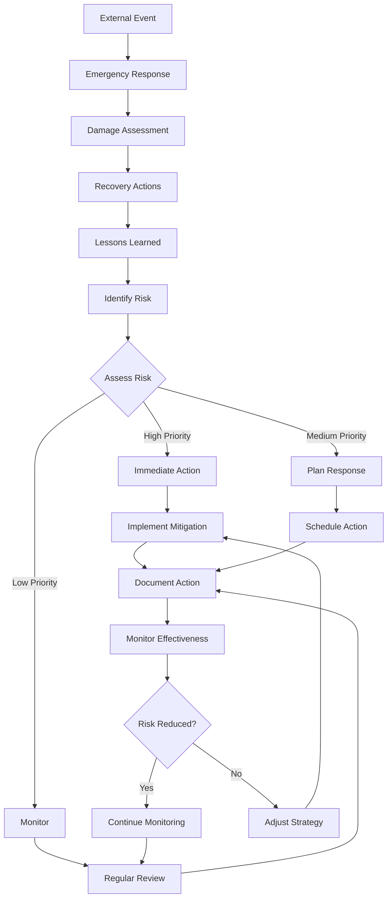
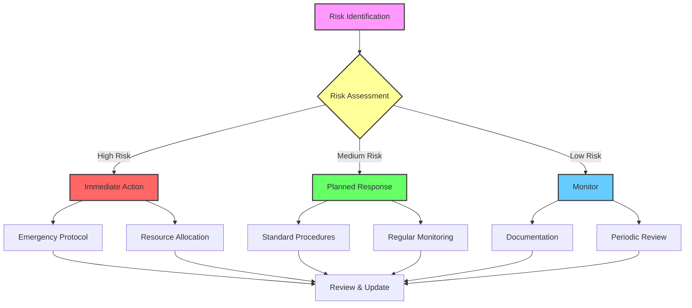
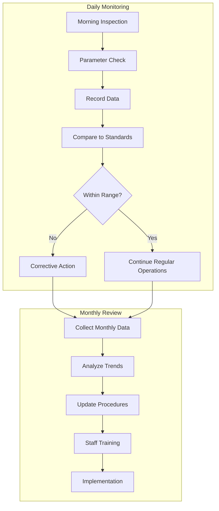

# RISK MANAGEMENT FRAMEWORK

## Instructions

This risk management guide helps you identify, assess, and mitigate risks to your agricultural operation. Customize each section based on your specific crops, location, market conditions, and operational setup. Regular risk assessment and contingency planning are essential for business sustainability.

---

## 6.1 Risk Assessment Framework

### Risk Rating System

**Use this system to evaluate all identified risks:**

| Risk Level | Impact Score | Probability Score | Priority | Action Required                      |
| ---------- | ------------ | ----------------- | -------- | ------------------------------------ |
| Critical   | 5            | 0.8-1.0           | Urgent   | Immediate action, daily monitoring   |
| High       | 4            | 0.6-0.7           | High     | Urgent attention, weekly monitoring  |
| Medium     | 3            | 0.4-0.5           | Medium   | Planned response, monthly monitoring |
| Low        | 2            | 0.2-0.3           | Low      | Monitor, quarterly review            |
| Negligible | 1            | 0.0-0.1           | Minimal  | Note and watch for changes           |

**Risk Score Calculation:**

```
Risk Score = Impact × Probability
```

**Impact Scoring Guide:**

- **5 (Catastrophic)**: Could cause business failure or total crop loss
- **4 (Major)**: Significant financial loss or production disruption (>50%)
- **3 (Moderate)**: Noticeable impact but manageable (25-50% loss)
- **2 (Minor)**: Small impact, easily recovered (<25% loss)
- **1 (Minimal)**: Negligible effect on operations

**Probability Scoring Guide:**

- **0.9-1.0**: Almost certain (>90% chance)
- **0.7-0.8**: Likely (70-90% chance)
- **0.5-0.6**: Possible (50-70% chance)
- **0.3-0.4**: Unlikely (30-50% chance)
- **0.1-0.2**: Rare (10-30% chance)
- **<0.1**: Very rare (<10% chance)

### Comprehensive Risk Inventory

**Create a master list of all identified risks:**

| Risk ID | Category      | Risk Description | Impact | Probability | Risk Score | Priority |
| ------- | ------------- | ---------------- | ------ | ----------- | ---------- | -------- |
| E-01    | Environmental | [Specific risk]  | [1-5]  | [0-1]       | [Score]    | [Level]  |
| E-02    | Environmental | [Specific risk]  | [1-5]  | [0-1]       | [Score]    | [Level]  |
| O-01    | Operational   | [Specific risk]  | [1-5]  | [0-1]       | [Score]    | [Level]  |
| M-01    | Market        | [Specific risk]  | [1-5]  | [0-1]       | [Score]    | [Level]  |
| F-01    | Financial     | [Specific risk]  | [1-5]  | [0-1]       | [Score]    | [Level]  |

---

## 6.2 Environmental and Climate Risks

### Weather-Related Risks

**Identify climate risks specific to your location:**

| Risk           | Description           | Impact (1-5) | Probability | Vulnerable Crops | Season/Timing |
| -------------- | --------------------- | ------------ | ----------- | ---------------- | ------------- |
| Frost          | [Temperature drops]   | [Score]      | [0-1]       | [List crops]     | [Months]      |
| Extreme heat   | [Heat waves]          | [Score]      | [0-1]       | [List crops]     | [Months]      |
| Drought        | [Extended dry period] | [Score]      | [0-1]       | [All crops]      | [Months]      |
| Excessive rain | [Flooding]            | [Score]      | [0-1]       | [List crops]     | [Months]      |
| Hail           | [Hail storms]         | [Score]      | [0-1]       | [List crops]     | [Months]      |
| High winds     | [Storm damage]        | [Score]      | [0-1]       | [List crops]     | [Months]      |

### Climate Risk Mitigation Strategies

**For each major climate risk, document:**

#### Risk: [Your Climate Risk]

**Mitigation Measures:**

1. **Preventive Actions:**
   - [Action 1 - e.g., install frost protection]
   - [Action 2 - e.g., implement shade systems]
   - [Action 3 - e.g., build windbreaks]
   - Cost: [Amount]

2. **Monitoring Systems:**
   - [Weather forecasting services used]
   - [Alert systems in place]
   - [Monitoring frequency]
   - Cost: [Amount]

3. **Response Protocols:**
   - [Step 1 when warning received]
   - [Step 2 during event]
   - [Step 3 post-event assessment]

4. **Recovery Plans:**
   - [Damage assessment procedure]
   - [Emergency repairs process]
   - [Insurance claims process]
   - [Replanting or recovery timeline]

### Pest and Disease Risks

**Document major pest and disease threats:**

| Pest/Disease | Description | Impact | Probability | Affected Crops | Prevention Cost | Treatment Cost |
| ------------ | ----------- | ------ | ----------- | -------------- | --------------- | -------------- |
| [Pest 1]     | [Details]   | [1-5]  | [0-1]       | [Crops]        | [Amount]        | [Amount]       |
| [Disease 1]  | [Details]   | [1-5]  | [0-1]       | [Crops]        | [Amount]        | [Amount]       |
| [Pest 2]     | [Details]   | [1-5]  | [0-1]       | [Crops]        | [Amount]        | [Amount]       |

### Pest and Disease Management Plan

**For each major threat:**

#### Threat: [Specific Pest or Disease]

**Prevention Strategy:**

- Cultural practices: [Rotation, sanitation, resistant varieties]
- Monitoring: [Frequency, method, thresholds]
- Preventive treatments: [Schedule, products, cost]
- Estimated prevention cost: [Annual amount]

**Response Plan:**

- Early detection indicators: [What to watch for]
- Treatment threshold: [When to act]
- Treatment options: [Products, methods]
- Application timing: [Critical periods]
- Estimated treatment cost: [Per outbreak]

**Outbreak Management:**

- Isolation procedures: [Contain affected areas]
- Communication plan: [Who to notify]
- Recovery timeline: [Expected duration]
- Replanting plan: [If necessary]

---

## 6.3 Operational Risks

### Infrastructure and Equipment Risks

**Assess critical infrastructure:**

| System/Equipment  | Criticality (1-5) | Failure Impact | Failure Probability | Mitigation               | Backup Plan       | Maintenance Cost |
| ----------------- | ----------------- | -------------- | ------------------- | ------------------------ | ----------------- | ---------------- |
| Irrigation system | [Score]           | [Impact]       | [0-1]               | [Preventive maintenance] | [Manual watering] | [Cost]           |
| [Equipment 1]     | [Score]           | [Impact]       | [0-1]               | [Mitigation]             | [Backup]          | [Cost]           |
| [Equipment 2]     | [Score]           | [Impact]       | [0-1]               | [Mitigation]             | [Backup]          | [Cost]           |
| [Structure 1]     | [Score]           | [Impact]       | [0-1]               | [Mitigation]             | [Backup]          | [Cost]           |

### Infrastructure Protection Plan

**For critical infrastructure:**

**Preventive Maintenance Schedule:**

- [ ] Daily checks: [List what to inspect]
- [ ] Weekly maintenance: [Tasks]
- [ ] Monthly service: [Tasks]
- [ ] Annual overhaul: [Tasks]
- Maintenance budget: [Annual amount]

**Failure Response:**

1. Detection: [How failure is identified]
2. Immediate action: [First response steps]
3. Backup activation: [Alternative system]
4. Repair process: [Who, how, timeline]
5. Documentation: [Recording for future prevention]

**Replacement Fund:**

- Equipment lifespan: [Years]
- Replacement cost: [Amount]
- Annual reserve: [Amount to save yearly]

### Labor and Human Resource Risks

**Identify people-related risks:**

| Risk                    | Impact | Probability | Mitigation Strategy               | Cost   | Priority |
| ----------------------- | ------ | ----------- | --------------------------------- | ------ | -------- |
| Key person dependency   | [1-5]  | [0-1]       | [Cross-training, documentation]   | [Cost] | [Level]  |
| Staff turnover          | [1-5]  | [0-1]       | [Competitive wages, good culture] | [Cost] | [Level]  |
| Skill gaps              | [1-5]  | [0-1]       | [Training programs]               | [Cost] | [Level]  |
| Seasonal labor shortage | [1-5]  | [0-1]       | [Early booking, multiple sources] | [Cost] | [Level]  |
| Safety incidents        | [1-5]  | [0-1]       | [Safety protocols, training, PPE] | [Cost] | [Level]  |

### Human Resource Risk Management

**Training and Development:**

- Required skills: [List]
- Training schedule: [Frequency]
- Training budget: [Amount]
- Cross-training plan: [Who learns what]

**Safety Management:**

- Safety protocols: [Document key procedures]
- Personal protective equipment: [What's required]
- Safety training: [Frequency, topics]
- Incident response: [Emergency procedures]
- Safety budget: [Annual amount]

**Succession Planning:**

- Key roles: [Critical positions]
- Backup personnel: [Who can fill in]
- Documentation: [Where procedures are recorded]
- Knowledge transfer: [How knowledge is preserved]

---

## 6.4 Market and Business Risks

### Market Price and Demand Risks

**Assess market vulnerabilities:**

| Market Risk             | Description          | Impact | Probability | Mitigation Strategy                   | Cost     |
| ----------------------- | -------------------- | ------ | ----------- | ------------------------------------- | -------- |
| Price volatility        | [Price drops]        | [1-5]  | [0-1]       | [Diversify markets, value-add]        | [Amount] |
| Demand reduction        | [Market shrinks]     | [1-5]  | [0-1]       | [Market research, diversification]    | [Amount] |
| Input cost increases    | [Higher expenses]    | [1-5]  | [0-1]       | [Bulk buying, alternatives]           | [Amount] |
| Market oversupply       | [Too much product]   | [1-5]  | [0-1]       | [Storage, processing, contracts]      | [Amount] |
| Supply chain disruption | [Can't reach market] | [1-5]  | [0-1]       | [Multiple distributors, direct sales] | [Amount] |

### Market Risk Mitigation Strategies

**Price Risk Management:**

- Forward contracts: [% of production to contract]
- Price triggers: [Minimum acceptable price]
- Alternative markets: [Backup sales channels]
- Value-added options: [Processing to preserve value]
- Cost management: [Strategies to maintain margins]

**Demand Risk Management:**

- Market diversification: [# of customer segments]
- Product diversification: [Multiple crops/products]
- Customer relationships: [Loyalty programs, contracts]
- Market intelligence: [How you track demand trends]

### Competitive Risks

| Competitive Threat    | Impact | Probability | Response Strategy                  | Investment Needed |
| --------------------- | ------ | ----------- | ---------------------------------- | ----------------- |
| New competitors       | [1-5]  | [0-1]       | [Strengthen brand, quality]        | [Amount]          |
| Price competition     | [1-5]  | [0-1]       | [Differentiate on quality/service] | [Amount]          |
| Market share loss     | [1-5]  | [0-1]       | [Customer retention programs]      | [Amount]          |
| Substitute products   | [1-5]  | [0-1]       | [Innovation, unique offerings]     | [Amount]          |
| Technology disruption | [1-5]  | [0-1]       | [Stay informed, adapt]             | [Amount]          |

**Competitive Advantage Protection:**

- Unique value propositions: [What sets you apart]
- Customer loyalty initiatives: [Retention strategies]
- Quality maintenance: [Standards and monitoring]
- Innovation pipeline: [New products/methods in development]
- Brand building: [Marketing investments]

---

## 6.5 Financial Risks

### Cash Flow Risks

**Identify financial vulnerabilities:**

| Financial Risk               | Description           | Impact | Probability | Mitigation                    | Reserve Needed |
| ---------------------------- | --------------------- | ------ | ----------- | ----------------------------- | -------------- |
| Insufficient working capital | [Cash shortage]       | [1-5]  | [0-1]       | [Build reserves, credit line] | [Amount]       |
| Seasonal cash flow gaps      | [Low revenue periods] | [1-5]  | [0-1]       | [Save during high season]     | [Amount]       |
| Late customer payments       | [Receivables delays]  | [1-5]  | [0-1]       | [Payment terms, deposits]     | [Amount]       |
| Unexpected expenses          | [Emergency costs]     | [1-5]  | [0-1]       | [Contingency fund]            | [Amount]       |
| Debt service burden          | [Loan payments]       | [1-5]  | [0-1]       | [Conservative borrowing]      | [Amount]       |

### Financial Risk Management Plan

**Cash Reserve Strategy:**

- Target reserve: [# months of operating expenses]
- Reserve amount: [Specific amount]
- Reserve building plan: [How to accumulate]
- Reserve access: [Where held, how quickly available]

**Credit and Financing:**

- Credit lines established: [Amount available]
- Lending relationships: [Banks, ag lenders]
- Collateral available: [Assets for securing loans]
- Debt capacity: [Maximum advisable debt load]

**Insurance Coverage:**

| Insurance Type        | Coverage Amount | Annual Premium | Deductible | Provider   | Notes              |
| --------------------- | --------------- | -------------- | ---------- | ---------- | ------------------ |
| Property/assets       | [Amount]        | [Cost]         | [Amount]   | [Provider] | [Details]          |
| Crop insurance        | [Amount]        | [Cost]         | [Amount]   | [Provider] | [Coverage details] |
| Liability             | [Amount]        | [Cost]         | [Amount]   | [Provider] | [What's covered]   |
| Business interruption | [Amount]        | [Cost]         | [Amount]   | [Provider] | [Triggers]         |
| Equipment breakdown   | [Amount]        | [Cost]         | [Amount]   | [Provider] | [Items covered]    |
| **Total**             | **[Total]**     | **[Total]**    |            |            |                    |

**Investment Protection:**

- Asset maintenance: [Regular upkeep to preserve value]
- Documentation: [Records for insurance and loans]
- Valuation updates: [Regular assessment of asset values]
- Risk reduction: [Measures to lower insurance premiums]

---

## 6.6 Contingency Planning

### Emergency Response Framework

**Develop plans for major disruptions:**

#### Contingency Plan Template

**For each major risk scenario:**

**Scenario: [Specific Emergency - e.g., Total Irrigation Failure]**

**Warning Signs:**

- [Indicator 1 that this might happen]
- [Indicator 2]
- [Indicator 3]

**Immediate Response (0-24 hours):**

1. [First action]
2. [Second action]
3. [Third action]
4. [Who to contact]
5. [Resources to deploy]

**Short-term Response (1-7 days):**

1. [Actions to stabilize situation]
2. [Alternative operations]
3. [Communication with stakeholders]
4. [Assessment of damage/impact]

**Medium-term Recovery (1-4 weeks):**

1. [Repair/replacement actions]
2. [Modified operations]
3. [Financial management]
4. [Customer communication]

**Long-term Adaptation (1+ months):**

1. [Permanent solutions]
2. [Prevention measures]
3. [System improvements]
4. [Lessons learned]

**Resources Required:**

- Financial: [Emergency fund amount]
- Equipment: [Backup equipment or rentals]
- Labor: [Additional help needed]
- Expertise: [External consultants or specialists]

**Key Contacts:**
| Role | Name | Phone | Email | Purpose |
|------|------|-------|-------|---------|
| Insurance agent | [Name] | [Phone] | [Email] | [Claims] |
| Equipment repair | [Name] | [Phone] | [Email] | [Repairs] |
| Emergency supplier | [Name] | [Phone] | [Email] | [Inputs] |
| Backup labor | [Name] | [Phone] | [Email] | [Help] |
| Agricultural extension | [Name] | [Phone] | [Email] | [Advice] |

### Business Continuity Planning

**Essential operations to maintain:**

| Critical Function | Maximum Tolerable Downtime | Backup Method        | Resources Needed | Priority       |
| ----------------- | -------------------------- | -------------------- | ---------------- | -------------- |
| [Function 1]      | [Hours/days]               | [Alternative method] | [List]           | [High/Med/Low] |
| [Function 2]      | [Hours/days]               | [Alternative method] | [List]           | [Priority]     |
| [Function 3]      | [Hours/days]               | [Alternative method] | [List]           | [Priority]     |

**Communication Plan During Crisis:**

- Internal communication: [How team stays informed]
- Customer communication: [How to notify customers]
- Supplier communication: [Keeping suppliers informed]
- Stakeholder updates: [Investors, partners, lenders]
- Public relations: [If media interest]

---

## 6.7 Risk Monitoring and Review

### Ongoing Risk Assessment

**Regular monitoring schedule:**

**Daily Monitoring:**

- Weather forecasts
- Irrigation system function
- Crop health visual checks
- Security and safety

**Weekly Reviews:**

- Pest and disease pressure
- Equipment condition
- Financial dashboard
- Market price tracking

**Monthly Assessments:**

- Full risk inventory review
- Financial position analysis
- Infrastructure inspection
- Customer feedback review
- Staff concerns and suggestions

**Quarterly Comprehensive Review:**

- Update risk scores (impact and probability)
- Review mitigation effectiveness
- Adjust contingency plans
- Update insurance coverage
- Review market conditions
- Financial performance vs. projections

**Annual Strategic Review:**

- Complete risk inventory refresh
- Major contingency plan updates
- Insurance policy renewals and adjustments
- Long-term risk trend analysis
- Strategic planning adjustments

### Risk Documentation

**Maintain these records:**

**Risk Register:**

- All identified risks with current scores
- Mitigation measures in place
- Responsibility assignments
- Review dates and history

**Incident Log:**

- Date and description of risk events
- Impact and response
- Lessons learned
- Prevention measures implemented

**Decision Journal:**

- Major risk management decisions
- Rationale and expected outcomes
- Actual results
- Insights for future decisions

### Risk Reporting Dashboard

**Key metrics to track:**

| Risk Indicator              | Current Status | Target   | Trend   | Action Needed |
| --------------------------- | -------------- | -------- | ------- | ------------- |
| Cash reserves               | [Amount]       | [Target] | [↑/↓/→] | [Yes/No]      |
| Insurance coverage adequacy | [%]            | [100%+]  | [Trend] | [Action]      |
| Equipment condition score   | [Score]        | [Target] | [Trend] | [Action]      |
| Pest/disease incidence      | [Level]        | [Low]    | [Trend] | [Action]      |
| Safety incident rate        | [Rate]         | [0]      | [Trend] | [Action]      |
| Customer retention rate     | [%]            | [Target] | [Trend] | [Action]      |
| Debt service coverage       | [Ratio]        | [>1.5]   | [Trend] | [Action]      |

### Risk Management Process Flow



---

## Risk Management Checklist

Ensure your risk management plan is comprehensive:

- [ ] Identified all major risk categories (environmental, operational, market, financial)
- [ ] Assessed each risk for impact and probability
- [ ] Prioritized risks by score
- [ ] Developed mitigation strategies for high-priority risks
- [ ] Created contingency plans for critical scenarios
- [ ] Secured appropriate insurance coverage
- [ ] Established cash reserves and emergency funds
- [ ] Implemented preventive measures
- [ ] Set up monitoring systems
- [ ] Documented all risks and plans
- [ ] Assigned responsibilities for risk management
- [ ] Established regular review schedule
- [ ] Communicated plans to relevant stakeholders
- [ ] Tested emergency response procedures
- [ ] Created contact lists for emergencies

---

**Remember:**

- Risk management is ongoing, not one-time
- Be proactive, not just reactive
- Document everything for learning and improvement
- Review and update regularly as conditions change
- Involve your whole team in risk awareness
- Balance risk mitigation costs with risk levels
- Don't over-insure or under-insure
- Build resilience into your operation

[Previous](market-strategy.md) | [Next](implementation-timeline.md)

- Utilize emergency contact list
- Deploy backup equipment
- Develop a recovery timeline

2. **Market Disruption**
   - Explore alternative sales channels
   - Implement product storage plans
   - Adjust pricing strategies
   - Maintain transparent customer communication

3. **Environmental Emergency**
   - Employ weather monitoring systems
   - Deploy protective measures
   - Conduct damage assessments
   - Execute recovery protocols

### Recovery Timelines

| **Event Type** | **Response Time** | **Recovery Period** | **Cost Impact** |
| -------------- | ----------------- | ------------------- | --------------- |
| Minor          | <2 hours          | 1-2 days            | <R1,000         |
| Moderate       | <6 hours          | 3-7 days            | R1,000-5,000    |
| Major          | <12 hours         | 1-4 weeks           | R5,000-20,000   |
| Critical       | <1 hour           | 1-3 months          | >R20,000        |

---

## 6.7 Risk Monitoring and Review

### Monthly Review Checklist

- [ ] Update risk register
- [ ] Review incident reports
- [ ] Assess mitigation effectiveness
- [ ] Update standard procedures
- [ ] Verify insurance coverage
- [ ] Check emergency supplies
- [ ] Test communication systems
- [ ] Evaluate training needs

### Quarterly Assessment

1. **Risk Trends Analysis**
   - Identify patterns
   - Measure effectiveness of strategies
   - Conduct cost-benefit analyses
   - Adjust strategies as needed

2. **Resource Allocation Review**
   - Evaluate budget utilization
   - Confirm reserve adequacy
   - Measure training program impact
   - Inspect equipment readiness





[Previous](market-strategy.md) | [Next](implementation-timeline.md)
