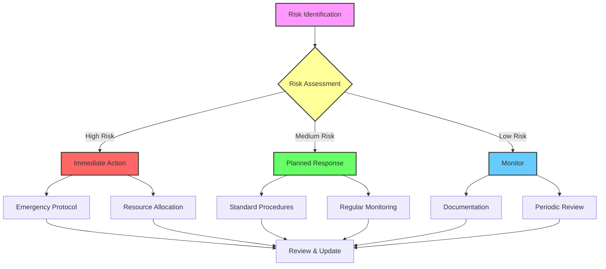
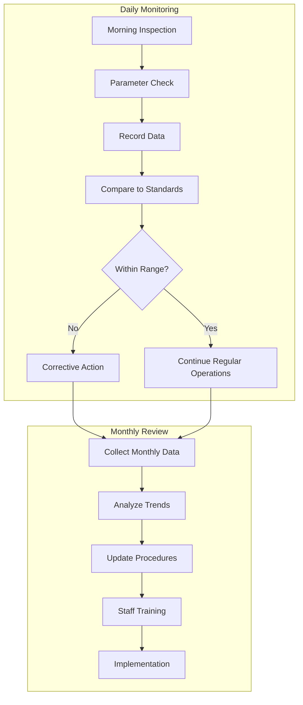

# 6. RISK MANAGEMENT AND MITIGATION

## 6.1 Risk Assessment Matrix

### Risk Categories and Ratings
| **Risk Level** | **Impact Score** | **Probability Score** | **Action Required** |
|----------------|------------------|-----------------------|---------------------|
| Critical       | 5                | 0.8-1.0              | Immediate action   |
| High           | 4                | 0.6-0.7              | Urgent attention   |
| Medium         | 3                | 0.4-0.5              | Planned response   |
| Low            | 2                | 0.2-0.3              | Monitor            |
| Negligible     | 1                | 0.0-0.1              | Note               |

---

## 6.2 Environmental Risks

### Climate-Related Risks
| **Risk**          | **Impact** | **Probability** | **Mitigation Strategy**          | **Cost (ZAR)** |
|-------------------|------------|-----------------|----------------------------------|----------------|
| Frost Damage      | 5          | 0.4             | Install frost protection system | R3,500         |
| Heat Waves        | 4          | 0.6             | Enhanced shade systems          | R2,800         |
| Hail              | 5          | 0.3             | Protective netting              | R4,200         |
| Drought           | 4          | 0.5             | Water storage system            | R5,500         |

### Pest and Disease Risks
| **Risk**         | **Impact** | **Probability** | **Mitigation Strategy**  | **Cost (ZAR)** |
|------------------|------------|-----------------|--------------------------|----------------|
| Stem Rot         | 4          | 0.4             | Preventive fungicides    | R800/month     |
| Mealybugs        | 3          | 0.6             | Integrated Pest Management (IPM) program | R600/month |
| Fruit Flies      | 3          | 0.5             | Trapping system          | R400/month     |
| Viral Disease    | 5          | 0.2             | Plant certification      | R1,500/year    |

---

## 6.3 Operational Risks

### Infrastructure
| **Component**      | **Risk**          | **Impact** | **Mitigation**         | **Backup Plan**       |
|--------------------|------------------|------------|------------------------|-----------------------|
| Irrigation         | System failure   | 5          | Regular maintenance    | Manual watering       |
| Support Structure  | Collapse         | 4          | Monthly inspection     | Emergency repairs     |
| Storage Facility   | Power failure    | 3          | Backup generator       | Alternative storage   |
| Transport          | Vehicle breakdown| 3          | Service contract       | Backup transport      |

### Labor and Skills
| **Risk Area**      | **Impact** | **Mitigation Strategy**  | **Training Required** |
|--------------------|------------|--------------------------|-----------------------|
| Staff turnover     | 3          | Cross-training program   | R1,200/person        |
| Skill gaps         | 4          | Regular workshops        | R2,000/quarter       |
| Safety incidents   | 5          | Safety protocols         | R800/person          |
| Quality control    | 4          | Standard procedures      | R1,500/quarter       |

---

## 6.4 Market Risks

### Price Volatility
| **Scenario**         | **Impact** | **Response Strategy**   | **Buffer Required** |
|----------------------|------------|-------------------------|---------------------|
| Price drop >20%      | 4          | Develop value-added products | R15,000         |
| Input cost spike     | 3          | Bulk purchasing         | R20,000            |
| Market oversupply    | 4          | Storage/processing      | R12,000            |
| Export barriers      | 3          | Focus on local market   | R8,000             |

### Competition Response
| **Threat**           | **Impact** | **Strategy**            | **Resource Needs**  |
|----------------------|------------|-------------------------|---------------------|
| New entrants         | 3          | Brand strengthening     | R5,000             |
| Price wars           | 4          | Quality differentiation | R3,000             |
| Market share loss    | 4          | Customer loyalty program| R4,000             |
| Substitute products  | 3          | Product innovation      | R6,000             |

---

## 6.5 Financial Risks

### Cash Flow Management
| **Risk**            | **Impact** | **Mitigation**        | **Reserve Required** |
|---------------------|------------|-----------------------|-----------------------|
| Late payments       | 3          | Flexible payment terms| R10,000              |
| Seasonal variations | 4          | Build cash reserves   | R25,000              |
| Emergency expenses  | 4          | Comprehensive insurance | R15,000            |
| Cost overruns       | 3          | Maintain contingency fund | R20,000          |

### Investment Protection
| **Area**            | **Protection Strategy**  | **Annual Cost** | **Coverage**       |
|---------------------|--------------------------|-----------------|--------------------|
| Assets              | Insurance policy        | R4,800          | R200,000          |
| Crop                | Multi-peril insurance   | R6,000          | R150,000          |
| Revenue             | Business interruption   | R3,600          | R100,000          |
| Liability           | Public liability        | R2,400          | R500,000          |

---

## 6.6 Contingency Plans

### Emergency Response Procedures
1. **System Failure**
   - Activate immediate notification system
   - Utilize emergency contact list
   - Deploy backup equipment
   - Develop a recovery timeline

2. **Market Disruption**
   - Explore alternative sales channels
   - Implement product storage plans
   - Adjust pricing strategies
   - Maintain transparent customer communication

3. **Environmental Emergency**
   - Employ weather monitoring systems
   - Deploy protective measures
   - Conduct damage assessments
   - Execute recovery protocols

### Recovery Timelines
| **Event Type** | **Response Time** | **Recovery Period** | **Cost Impact** |
|----------------|-------------------|---------------------|-----------------|
| Minor          | <2 hours         | 1-2 days            | <R1,000         |
| Moderate       | <6 hours         | 3-7 days            | R1,000-5,000    |
| Major          | <12 hours        | 1-4 weeks           | R5,000-20,000   |
| Critical       | <1 hour          | 1-3 months          | >R20,000        |

---

## 6.7 Risk Monitoring and Review

### Monthly Review Checklist
- [ ] Update risk register
- [ ] Review incident reports
- [ ] Assess mitigation effectiveness
- [ ] Update standard procedures
- [ ] Verify insurance coverage
- [ ] Check emergency supplies
- [ ] Test communication systems
- [ ] Evaluate training needs

### Quarterly Assessment
1. **Risk Trends Analysis**
   - Identify patterns
   - Measure effectiveness of strategies
   - Conduct cost-benefit analyses
   - Adjust strategies as needed

2. **Resource Allocation Review**
   - Evaluate budget utilization
   - Confirm reserve adequacy
   - Measure training program impact
   - Inspect equipment readiness

[Previous](market-strategy.md) | [Next](implementation-timeline.md)
