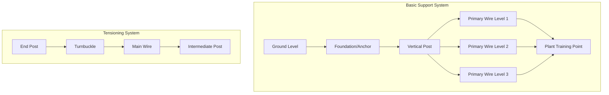
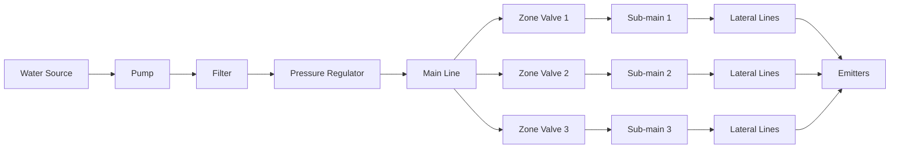

# TECHNICAL IMPLEMENTATION GUIDE

## Instructions

This guide provides a framework for planning and implementing the technical infrastructure for your agricultural operation. Adapt each section to your specific crops, location, available resources, and scale of operation.

---

## 2.1 Site Assessment and Specifications

### Site Analysis Template

**Complete this assessment for your farm location:**

#### Land Characteristics

| Aspect            | Measurement/Description   | Notes                             |
| ----------------- | ------------------------- | --------------------------------- |
| Total Area        | [Size in hectares/acres]  | [Usable area]                     |
| Topography        | [Flat/sloped/terraced]    | [Slope percentage if applicable]  |
| Soil Type         | [Sandy/clay/loam/etc.]    | [From soil test]                  |
| Drainage          | [Excellent/good/poor]     | [Natural drainage patterns]       |
| Access            | [Road quality, distance]  | [Equipment access considerations] |
| Orientation       | [Aspect/direction]        | [Sun exposure, wind exposure]     |
| Existing Features | [Buildings, trees, water] | [Assets and constraints]          |

#### Infrastructure Assessment

| Element            | Current Status            | Condition   | Upgrade Needed | Priority       |
| ------------------ | ------------------------- | ----------- | -------------- | -------------- |
| Water supply       | [Available/not available] | [Condition] | [Yes/No]       | [High/Med/Low] |
| Electricity        | [Available/not available] | [Capacity]  | [Yes/No]       | [High/Med/Low] |
| Fencing            | [Present/absent]          | [Condition] | [Yes/No]       | [High/Med/Low] |
| Storage facilities | [Present/absent]          | [Condition] | [Yes/No]       | [High/Med/Low] |
| Roads/paths        | [Present/absent]          | [Condition] | [Yes/No]       | [High/Med/Low] |
| Shelter/shade      | [Present/absent]          | [Type]      | [Yes/No]       | [High/Med/Low] |

---

## 2.2 Land Preparation and Layout

### Field Layout Planning

**Design your growing area layout based on your crops and system:**

#### Planting Layout Template

**Crop: [Your Crop Name]**

| Parameter               | Specification     | Justification                      |
| ----------------------- | ----------------- | ---------------------------------- |
| Row spacing             | [Distance]        | [Equipment width, crop needs]      |
| Plant spacing in row    | [Distance]        | [Growth habit, yield optimization] |
| Row orientation         | [N-S/E-W/contour] | [Sun exposure, drainage, slope]    |
| Path width              | [Distance]        | [Equipment access, harvest needs]  |
| Border clearance        | [Distance]        | [Wind, pests, regulations]         |
| Plants per unit area    | [Number/hectare]  | [Calculation basis]                |
| Total planting capacity | [Total number]    | [For available area]               |

#### Area Allocation

**For diversified operations, divide your land:**

| Zone         | Area   | Primary Crop(s) | Infrastructure Needs  | Notes                    |
| ------------ | ------ | --------------- | --------------------- | ------------------------ |
| Zone 1       | [Size] | [Crop name(s)]  | [List]                | [High-value, intensive]  |
| Zone 2       | [Size] | [Crop name(s)]  | [List]                | [Production area]        |
| Zone 3       | [Size] | [Crop name(s)]  | [List]                | [Expansion area]         |
| Service Area | [Size] | N/A             | [Storage, processing] | [Support infrastructure] |

### Visual Layout Diagram Template

Create a diagram showing:

- Field boundaries and dimensions
- Growing zones and crop locations
- Irrigation infrastructure layout
- Access roads and paths
- Storage and service areas
- Water sources and distribution
- Electrical connections
- Drainage patterns

**Use tools like:**

- Graph paper for hand-drawn plans
- SketchUp or similar 3D modeling software
- Farm management software
- CAD programs for detailed technical drawings

---

## 2.3 Seed Germination and Propagation Media

### Understanding Germination Requirements

**Ideal seed germination requires:**

- Consistent moisture (like a wrung-out sponge)
- Adequate oxygen for respiration
- Correct temperature range (typically 15–30°C for most seeds)
- Light or darkness (species-dependent)
- Sterile, well-aerated growing medium

**Key Success Factors:**

- Use light, sterile substrates to prevent compaction and root rot
- Maintain constant moisture without waterlogging
- Ensure good airflow to reduce damping off disease
- Avoid dense garden soil which can suffocate germinating seeds

### Common Seed Germination Substrates

**Overview of popular substrates and their properties:**

| Substrate    | Typical Cost (per litre) | Reusability | Sustainability | Comments                                |
| ------------ | ------------------------ | ----------- | -------------- | --------------------------------------- |
| Coconut Coir | Low–Medium               | High        | Excellent      | Renewable, affordable, compostable      |
| Perlite      | Medium                   | High        | Good           | Can be rinsed and reused                |
| Vermiculite  | Medium–High              | Limited     | Moderate       | Good for moisture but needs replacement |
| Peat Moss    | Medium                   | Limited     | Poor           | Non-renewable, often imported           |
| Rockwool     | Medium–High              | Low         | Poor           | Not biodegradable, single-use           |
| Biochar      | Medium                   | High        | Excellent      | Locally sourced possible, improves soil |

#### Substrate Characteristics

**Coconut Coir:**

- Excellent water retention and airflow
- Naturally sterile, prevents compaction
- Reduces risk of root rot
- Requires fertilization after initial sprouting
- Best balance for cost, performance, and sustainability

**Perlite:**

- Increases drainage and aeration
- Reduces risk of damping off and root rot
- Often mixed with coir, peat, or compost
- Higher initial cost but reusable, reducing long-term expenses

**Vermiculite:**

- Retains water while maintaining aeration
- Excellent for seeds needing high humidity
- Good moisture retention for sensitive seeds

**Peat Moss:**

- Traditional standard in soilless mixes
- Good moisture retention and uniform environment
- Less sustainable than coconut coir
- Higher long-term costs due to single-use limitations

**Rockwool:**

- Sterile, inert, holds water well
- Provides consistent conditions
- Widely used for hydroponic germination
- Environmental concerns: not biodegradable

**Biochar:**

- High sustainability
- Potential for local sourcing or on-farm production
- Long-term soil benefits when transplanted
- May require initial investment

### Common Substrate Mixes for Seed Germination

**Mixing substrates balances moisture retention, drainage, aeration, and cost:**

#### Popular Mix Formulas

**1. Coconut Coir + Perlite:**

- Very popular for seed starting
- Coir holds moisture and provides structure
- Perlite adds drainage and improves aeration
- Ratio: 50% coir, 50% perlite (general purpose)
- Ratio: 60% coir, 40% perlite (faster drainage for succulents, herbs)

**2. Peat Moss (or Coco Coir) + Vermiculite/Perlite:**

- Classic seed-starting mix
- Vermiculite retains more water (good for humidity-loving seeds)
- Perlite chosen for more air and less damping off risk
- Ratio: 50% peat/coir, 25% perlite, 25% vermiculite (most seeds)

**3. Coco Coir + Perlite + Vermiculite:**

- Balanced blend for sensitive seeds
- Coir for structure and water retention
- Perlite for drainage
- Vermiculite for extra moisture
- Used for sensitive or slow-germinating seeds

**4. Biochar Additions:**

- Add 5–10% biochar to enrich mix
- Provides long-term benefits after transplanting

### Mixing Ratios by Crop Type

**Adjust substrate mix based on crop water needs:**

#### Standard Mix (Most Seeds)

- 50% coconut coir or peat moss
- 25% perlite
- 25% vermiculite

#### Fast Drainage Mix (Succulents, Herbs)

- 60% coir/peat
- 40% perlite

#### High Moisture Mix (Seeds Needing Extra Humidity)

- 50% vermiculite
- 40% coir/peat
- 10% perlite

### Financial Considerations

**Budget-conscious substrate selection:**

- **Coconut coir** offers the best balance: affordable, renewable, and effective
- **Perlite** has higher upfront cost but reusability reduces long-term expenses
- **Mix expensive materials** with cheaper renewable options to stretch budget
- **Biochar** requires initial investment but offers sustainability benefits
- **Avoid peat moss and rockwool** for long-term operations due to single-use costs

### Best Practices for Seed Germination

**Essential guidelines for success:**

1. **Use sterile media** to prevent disease
2. **Maintain consistent moisture** without waterlogging
3. **Ensure adequate drainage** to prevent root rot
4. **Provide proper temperature** for your specific seeds (15–30°C typical)
5. **Monitor daily** and adjust moisture as needed
6. **Start fertilization** once seedlings emerge (substrates are often nutrient-free)
7. **Transplant carefully** to avoid root disturbance
8. **Label everything** to track varieties and germination success

### Crop-Specific Germination Notes

**Temperature and substrate preferences by crop category:**

| Crop Category       | Optimal Temp Range | Preferred Substrate Mix                | Special Notes                         |
| ------------------- | ------------------ | -------------------------------------- | ------------------------------------- |
| Tomatoes, Peppers   | 21–29°C            | 50% coir, 25% perlite, 25% vermiculite | Need consistent warmth                |
| Lettuce, Brassicas  | 15–20°C            | 50% coir, 50% perlite                  | Prefer cooler conditions              |
| Cucumbers, Squash   | 21–29°C            | 50% coir, 30% perlite, 20% vermiculite | High moisture needs                   |
| Herbs (Basil, etc.) | 18–24°C            | 60% coir, 40% perlite                  | Good drainage prevents rot            |
| Root Vegetables     | 16–21°C            | 50% coir, 25% perlite, 25% vermiculite | Direct seed often preferred           |
| Legumes             | 18–27°C            | 50% coir, 50% perlite                  | Pre-soak seeds for faster germination |

---

## 2.4 Support Systems and Structures

### Support Structure Requirements (if applicable)

**For crops requiring support (vines, climbing plants, etc.):**

#### Support System Specifications

| Component               | Specification         | Quantity | Source/Supplier      | Cost Estimate |
| ----------------------- | --------------------- | -------- | -------------------- | ------------- |
| **Posts/Stakes**        |                       |          |                      |               |
| Material                | [Wood/metal/concrete] | [Number] | [Supplier]           | [Cost]        |
| Height                  | [Above ground]        |          |                      |               |
| Diameter/width          | [Size]                |          |                      |               |
| Anchor depth            | [Below ground]        |          |                      |               |
| Spacing                 | [Distance apart]      |          |                      |               |
| **Wire/Cable**          |                       |          |                      |               |
| Type                    | [Material, gauge]     | [Length] | [Supplier]           | [Cost]        |
| Strand count            | [Single/multi-strand] |          |                      |               |
| Training levels         | [Heights]             |          |                      |               |
| Tension requirements    | [Load capacity]       |          |                      |               |
| **Connectors/Fittings** |                       |          |                      |               |
| Turnbuckles             | [Size, type]          | [Number] | [Supplier]           | [Cost]        |
| Wire clips              | [Type]                | [Number] | [Supplier]           | [Cost]        |
| Anchors                 | [Type, size]          | [Number] | [Supplier]           | [Cost]        |
| **Installation**        |                       |          |                      |               |
| Labor                   | [Hours/days]          | [Total]  | [Contractor or self] | [Cost]        |

#### Support Structure Diagram

**Adapt this based on your specific crop needs:**

- Trellis systems (grapes, kiwi, passion fruit)
- Stake systems (tomatoes, peppers)
- Overhead wire systems (hops, pole beans)
- Wall/fence training (espalier fruit trees, climbing roses)

---

## 2.5 Irrigation System Design

### Water Requirements Analysis

**Calculate irrigation needs for your crops:**

| Crop     | Growth Stage  | Daily Water Need (L/plant or L/m²) | Frequency | Total Daily (L) |
| -------- | ------------- | ---------------------------------- | --------- | --------------- |
| [Crop 1] | Establishment | [Amount]                           | [Per day] | [Total]         |
| [Crop 1] | Vegetative    | [Amount]                           | [Per day] | [Total]         |
| [Crop 1] | Reproductive  | [Amount]                           | [Per day] | [Total]         |
| [Crop 2] | Establishment | [Amount]                           | [Per day] | [Total]         |
| [Crop 2] | Production    | [Amount]                           | [Per day] | [Total]         |

**Peak Water Demand:** [Total L/day in highest demand period]

### Irrigation System Selection

**Choose the most appropriate system for your crops and resources:**

| System Type      | Advantages                     | Disadvantages            | Cost Range | Best For                    |
| ---------------- | ------------------------------ | ------------------------ | ---------- | --------------------------- |
| Drip irrigation  | Water-efficient, precise       | Higher initial cost      | [Range]    | Row crops, orchards         |
| Sprinkler        | Flexible, cooling effect       | Water loss, disease risk | [Range]    | Field crops, turf           |
| Micro-sprinkler  | Good coverage, flexible        | Medium efficiency        | [Range]    | Orchards, vegetables        |
| Flood/furrow     | Low cost                       | Water wasteful           | [Range]    | Large fields, certain crops |
| Sub-surface drip | Very efficient, no evaporation | Expensive, clogging risk | [Range]    | High-value crops            |

**Selected System:** [Your choice]
**Justification:** [Reasons based on crops, budget, water availability]

### Irrigation System Components

#### Water Source

| Component           | Specification                    | Quantity | Cost   | Notes                    |
| ------------------- | -------------------------------- | -------- | ------ | ------------------------ |
| Source type         | [Well/river/municipal/rainwater] | N/A      | [Cost] | [Reliability]            |
| Storage tank        | [Capacity in L]                  | [Number] | [Cost] | [Material, placement]    |
| Pump                | [Power, flow rate]               | [Number] | [Cost] | [Type, efficiency]       |
| Filtration          | [Type, mesh size]                | [Number] | [Cost] | [Based on water quality] |
| Pressure regulation | [Type, pressure range]           | [Number] | [Cost] | [System requirements]    |

#### Distribution Network

| Component | Specification        | Length/Quantity   | Cost   | Notes                       |
| --------- | -------------------- | ----------------- | ------ | --------------------------- |
| Main line | [Diameter, material] | [Length in m]     | [Cost] | [From source to zones]      |
| Sub-mains | [Diameter, material] | [Length in m]     | [Cost] | [Zone distribution]         |
| Laterals  | [Diameter, material] | [Length in m]     | [Cost] | [To individual plants/rows] |
| Fittings  | [Types needed]       | [List quantities] | [Cost] | [Connectors, valves, etc.]  |

#### Emission Devices

| Component      | Specification               | Quantity       | Cost         | Notes               |
| -------------- | --------------------------- | -------------- | ------------ | ------------------- |
| Emitter type   | [Dripper/sprinkler/etc.]    | [Number]       | [Cost]       | [Flow rate]         |
| Flow rate      | [L/hour per emitter]        | N/A            | N/A          | [Crop requirements] |
| Spacing        | [Distance between emitters] | N/A            | N/A          | [Plant spacing]     |
| Per plant/area | [Number per plant]          | [Total needed] | [Total cost] | [Coverage pattern]  |

### Control and Automation

**Select appropriate control system:**

| Feature             | Basic Manual  | Semi-Automatic | Fully Automatic      | Your Selection |
| ------------------- | ------------- | -------------- | -------------------- | -------------- |
| Control method      | Manual valves | Timers         | Controller + sensors | [Choice]       |
| Cost                | Low           | Medium         | High                 | [Cost]         |
| Labor required      | High          | Medium         | Low                  | [Hours/week]   |
| Flexibility         | Low           | Medium         | High                 | [Rating]       |
| Zone control        | Limited       | Yes            | Yes                  | [# zones]      |
| Weather integration | No            | No             | Yes                  | [Available?]   |
| Remote monitoring   | No            | No             | Yes                  | [Needed?]      |

**Selected Control System Components:**

- Controller: [Type, brand, features]
- Sensors: [Soil moisture, weather, flow, pressure]
- Valves: [Solenoid, manual backup]
- Power supply: [Electrical, solar, battery]
- Monitoring: [App, alerts, data logging]

### Irrigation System Diagram

---

## 2.6 Infrastructure Development

### Essential Facilities

**Plan supporting infrastructure for your operation:**

#### Storage Facilities

| Facility Type     | Size         | Specifications            | Cost   | Priority       |
| ----------------- | ------------ | ------------------------- | ------ | -------------- |
| Tool storage      | [Dimensions] | [Materials, features]     | [Cost] | [High/Med/Low] |
| Input storage     | [Dimensions] | [Secure, climate control] | [Cost] | [High/Med/Low] |
| Produce storage   | [Dimensions] | [Refrigeration, shelving] | [Cost] | [High/Med/Low] |
| Equipment shelter | [Dimensions] | [Cover for machinery]     | [Cost] | [High/Med/Low] |

#### Processing Area (if applicable)

| Feature              | Specification           | Cost   | Priority       |
| -------------------- | ----------------------- | ------ | -------------- |
| Washing station      | [Size, water supply]    | [Cost] | [High/Med/Low] |
| Sorting/grading area | [Size, equipment]       | [Cost] | [High/Med/Low] |
| Packing area         | [Size, materials]       | [Cost] | [High/Med/Low] |
| Cold storage         | [Capacity, temperature] | [Cost] | [High/Med/Low] |

#### Other Infrastructure

| Item               | Specification          | Cost   | Priority   | Notes                |
| ------------------ | ---------------------- | ------ | ---------- | -------------------- |
| Fencing            | [Length, type, height] | [Cost] | [Priority] | [Security, animals]  |
| Access roads       | [Length, surface]      | [Cost] | [Priority] | [All-weather access] |
| Shade structures   | [Area, type]           | [Cost] | [Priority] | [Climate needs]      |
| Windbreaks         | [Length, type]         | [Cost] | [Priority] | [Wind protection]    |
| Composting area    | [Size]                 | [Cost] | [Priority] | [Organic matter]     |
| Office/admin space | [Size]                 | [Cost] | [Priority] | [Records, planning]  |

---

## 2.7 Equipment and Tools

### Essential Equipment List

**Inventory of required equipment:**

#### Major Equipment

| Equipment            | Specification    | Quantity | Cost   | Purchase/Lease/Rent | Priority   |
| -------------------- | ---------------- | -------- | ------ | ------------------- | ---------- |
| Tractor              | [HP, features]   | [#]      | [Cost] | [Option]            | [Priority] |
| Implements           | [List types]     | [#]      | [Cost] | [Option]            | [Priority] |
| Sprayer              | [Capacity, type] | [#]      | [Cost] | [Option]            | [Priority] |
| Harvesting equipment | [Type]           | [#]      | [Cost] | [Option]            | [Priority] |

#### Hand Tools and Small Equipment

| Tool Type          | Items Needed            | Quantity | Cost   | Priority   |
| ------------------ | ----------------------- | -------- | ------ | ---------- |
| Digging tools      | [Shovels, forks, etc.]  | [#]      | [Cost] | [Priority] |
| Cutting tools      | [Pruners, saws, knives] | [#]      | [Cost] | [Priority] |
| Measuring tools    | [Tape, pH meter, etc.]  | [#]      | [Cost] | [Priority] |
| Safety equipment   | [Gloves, boots, PPE]    | [#]      | [Cost] | [High]     |
| Harvest containers | [Bins, baskets, crates] | [#]      | [Cost] | [Priority] |
| Maintenance tools  | [Basic tool set]        | [#]      | [Cost] | [Priority] |

---

## 2.8 Safety and Compliance

### Safety Considerations

**Essential safety measures:**

- [ ] First aid kit and trained personnel
- [ ] Emergency contact numbers posted
- [ ] Fire extinguishers (if applicable)
- [ ] Proper storage for chemicals/inputs
- [ ] Safety signage and warnings
- [ ] Personal protective equipment (PPE)
- [ ] Safe water supply for workers
- [ ] Shade and rest areas
- [ ] Equipment safety features
- [ ] Emergency evacuation plan

### Regulatory Compliance

**Check and document required compliance:**

- [ ] Business licenses and permits
- [ ] Water use permits
- [ ] Environmental compliance
- [ ] Organic certification (if applicable)
- [ ] Food safety certifications
- [ ] Labor regulations compliance
- [ ] Insurance coverage
- [ ] Zoning/land use compliance

---

## 2.9 Implementation Checklist

Use this checklist to track technical implementation:

### Site Preparation

- [ ] Site survey and assessment completed
- [ ] Soil testing done
- [ ] Land clearing completed (if needed)
- [ ] Drainage issues addressed
- [ ] Access roads established

### Infrastructure Installation

- [ ] Water source secured
- [ ] Irrigation system installed and tested
- [ ] Electrical supply connected (if needed)
- [ ] Storage facilities built
- [ ] Fencing completed
- [ ] Support structures installed

### Equipment and Tools

- [ ] Major equipment acquired
- [ ] Hand tools purchased
- [ ] Safety equipment obtained
- [ ] Equipment properly stored

### System Testing

- [ ] Irrigation system pressure tested
- [ ] Water distribution verified
- [ ] Electrical systems checked
- [ ] Equipment operational testing
- [ ] Safety systems verified

### Final Preparations

- [ ] Planting areas prepared
- [ ] Inputs and materials stocked
- [ ] Staff training completed
- [ ] Emergency procedures established
- [ ] Record-keeping system set up

---

**Next Steps:**

1. Customize this guide for your specific crops and location
2. Get professional advice for complex systems (irrigation design, electrical)
3. Obtain necessary quotes and compare suppliers
4. Create detailed timeline for implementation
5. Arrange inspections and compliance certifications

[Previous](financial-analysis.md) | [Next](operations-manual.md)
