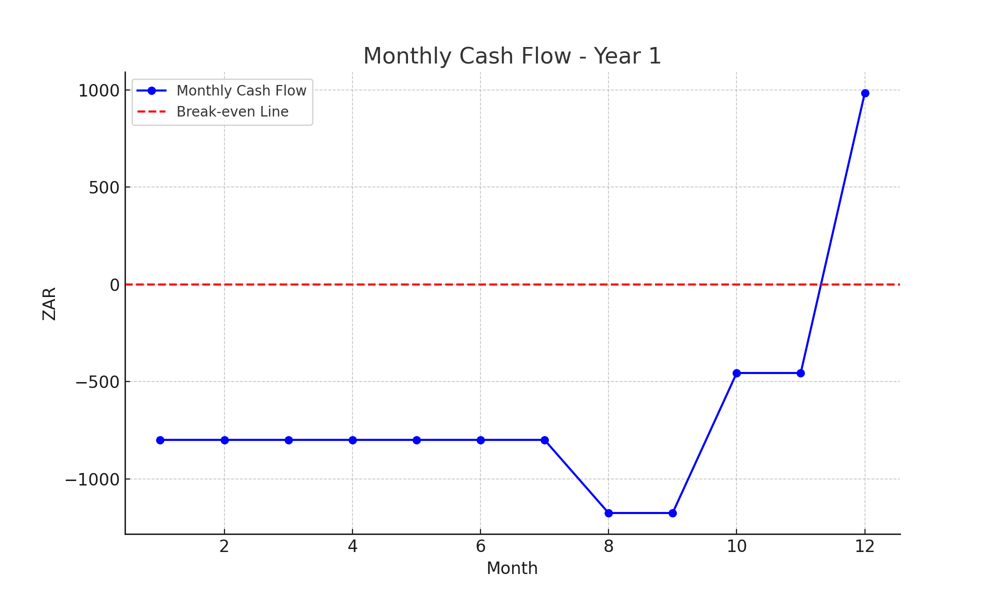
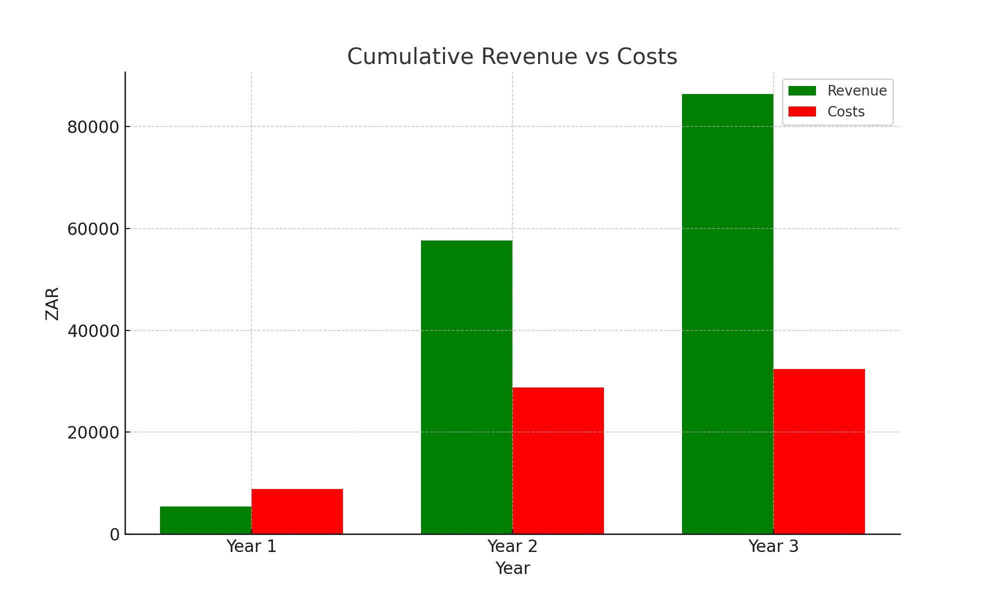
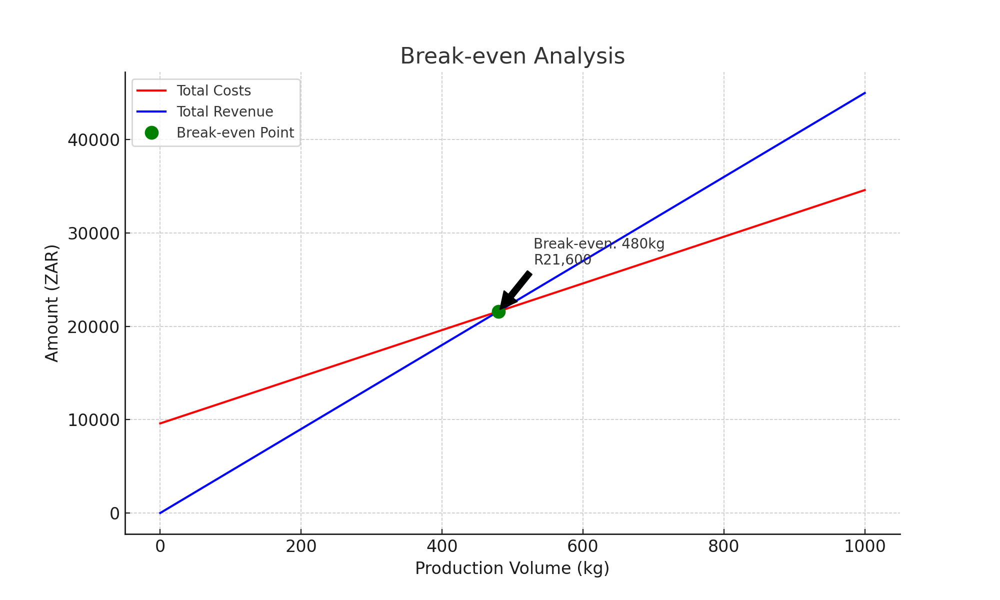
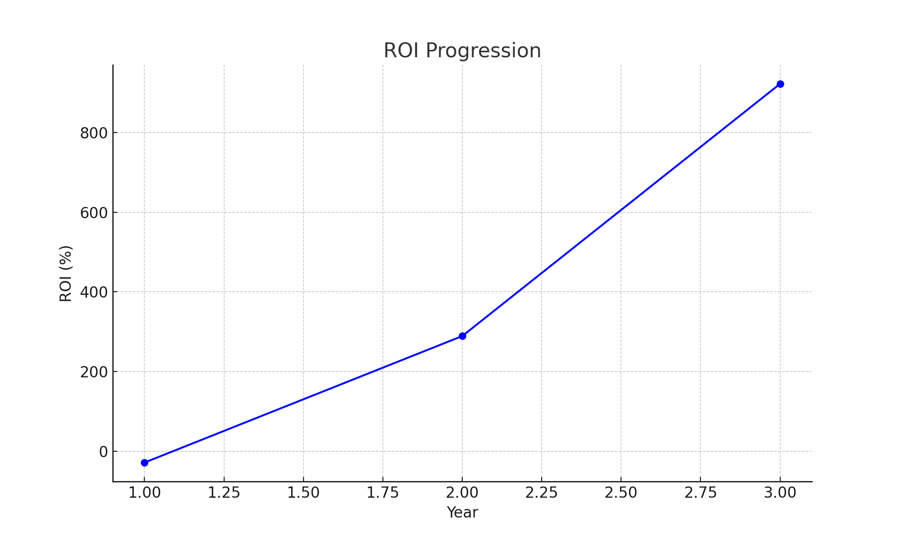
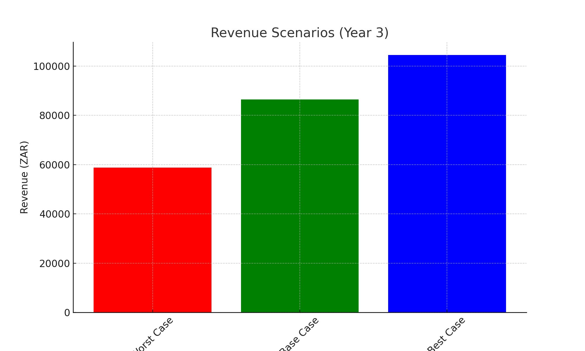

# 3. FINANCIAL ANALYSIS

## 3.1 Investment Structure

### Initial Capital Requirements
| **Category**        | **Item**               | **Cost (ZAR)** | **Subtotal** |
|---------------------|-----------------------|----------------|--------------|
| **Infrastructure**  |                       |                | **R4,850**   |
|                     | Support Posts         | R1,200         |              |
|                     | Wire System           | R850           |              |
|                     | Irrigation Components | R2,300         |              |
|                     | Installation Materials| R500           |              |
| **Plant Material**  |                       |                | **R2,550**   |
|                     | Dragon Fruit Cuttings (50) | R1,750     |              |
|                     | Growing Medium        | R500           |              |
|                     | Amendments            | R300           |              |
| **Equipment**       |                       |                | **R3,100**   |
|                     | Tools                 | R800           |              |
|                     | Monitoring Systems    | R1,500         |              |
|                     | Safety Equipment      | R800           |              |
| **Contingency**     | (15% of total)        | R1,575         | **R1,575**   |
| **Total Initial Investment** |             |                | **R12,075**  |

## 3.2 Operating Costs

### Fixed Monthly Costs
| **Expense Category** | **Monthly Cost (ZAR)** | **Annual Cost (ZAR)** |
|-----------------------|-----------------------|------------------------|
| Water                | R50                   | R600                  |
| Maintenance          | R100                  | R1,200                |
| Marketing            | R200                  | R2,400                |
| Transport Fund       | R300                  | R3,600                |
| Insurance            | R150                  | R1,800                |
| **Total Fixed Costs**| **R800**              | **R9,600**            |

### Variable Costs (From Month 8)
| **Item**             | **Unit Cost**         | **Monthly Estimate**  |
|----------------------|-----------------------|------------------------|
| Harvesting Labor     | R50/hour              | R400-600              |
| Packaging            | R5/kg                 | R136-340              |
| Delivery             | R10/km                | R200-400              |
| **Total Variable Costs** |                   | **R736-1,340**        |

## 3.3 Revenue Projections

### Year 1 Production Schedule
| **Month** | **Plants Producing** | **Fruit/Plant** | **Total Kg** | **Revenue (ZAR)** |
|-----------|-----------------------|-----------------|--------------|--------------------|
| 1-7       | 0                     | 0               | 0            | 0                  |
| 8-9       | 10                    | 2               | 8            | R360               |
| 10-11     | 20                    | 3               | 24           | R1,080             |
| 12        | 35                    | 4               | 56           | R2,520             |

### Year 2-3 Projections
| **Year** | **Plants** | **Avg Fruit/Plant** | **Total Kg** | **Revenue (ZAR)** |
|----------|------------|---------------------|--------------|--------------------|
| 2        | 50         | 8                   | 160          | R57,600            |
| 3        | 50         | 12                  | 240          | R86,400            |

## 3.4 Cash Flow Analysis

### Monthly Cash Flow Projection - Year 1


### Annual Cash Flow Summary


## 3.5 Break-Even Analysis

### Break-Even Calculation
- Fixed Costs (Annual): R9,600
- Variable Costs per Kg: R25
- Selling Price per Kg: R45
- Break-Even Point: **480 kg annually** (Based on 50 plants × 12 fruits/plant × 80% success rate at maturity).
- Expected Break-Even Timeline: Month 18



## 3.6 ROI Analysis

### Return on Investment Calculations
```
Initial Investment: R12,075
Cumulative Net Profit by Year:
Year 1: -R3,464
Year 2: +R25,336
Year 3: +R80,800

ROI at Year 3: 922.04%
```


## 3.7 Sensitivity Analysis

### Impact Variables
| **Factor**           | **Base Case** | **Worst Case** | **Best Case** |
|----------------------|---------------|----------------|---------------|
| Yield per Plant      | 12 fruits     | 10 fruits      | 14 fruits     |
| Price per Kg         | R45           | R35            | R55           |
| Success Rate         | 80%           | 70%            | 95%           |

### Scenario Outcomes
| **Scenario**         | **Annual Revenue** | **ROI (Year 3)** |
|----------------------|--------------------|------------------|
| Best Case            | R104,500          | 973%             |
| Base Case            | R86,400           | 922%             |
| Worst Case           | R58,800           | 780%             |



[Previous](technical-implementation.md) | [Next](operations-manual.md)
