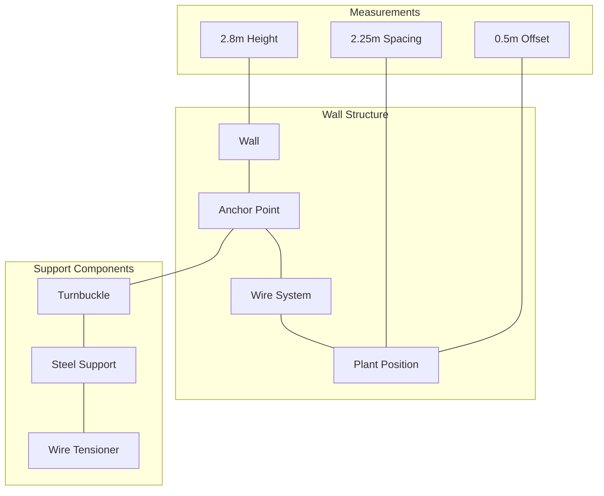

## 2.2 Plant Layout Design

### Spacing Requirements
- Plant-to-Plant Distance: 2.25 meters
- Wall Offset: 0.5 meters
- Path Width: 1 meter
- Corner Clearance: 1 meter radius

### Plant Distribution
- East-West Wall: 11 plants
- South-North Wall: 6 plants
- Total Plants: 17 per wall face
- Maximum Capacity: 50 plants (including secondary rows)

### Diagrams and Illustrations

#### Plant Layout Diagram
```svg
<svg viewBox="0 0 800 600" xmlns="http://www.w3.org/2000/svg">
  <!-- Grid Background -->
  <defs>
    <pattern id="smallGrid" width="10" height="10" patternUnits="userSpaceOnUse">
      <path d="M 10 0 L 0 0 0 10" fill="none" stroke="gray" stroke-width="0.5" opacity="0.2"/>
    </pattern>
  </defs>
  <rect width="800" height="600" fill="white"/>
  <rect width="800" height="600" fill="url(#smallGrid)"/>

  <!-- Walls -->
  <line x1="100" y1="400" x2="700" y2="400" stroke="black" stroke-width="10"/>
  <line x1="700" y1="400" x2="700" y2="100" stroke="black" stroke-width="10"/>

  <!-- Plants (circles) -->
  <g fill="green">
    <!-- East-West Wall Plants -->
    <circle cx="150" cy="420" r="10"/>
    <circle cx="225" cy="420" r="10"/>
    <circle cx="300" cy="420" r="10"/>
    <circle cx="375" cy="420" r="10"/>
    <circle cx="450" cy="420" r="10"/>
    <circle cx="525" cy="420" r="10"/>
    <circle cx="600" cy="420" r="10"/>
    <circle cx="675" cy="420" r="10"/>

    <!-- South-North Wall Plants -->
    <circle cx="720" cy="350" r="10"/>
    <circle cx="720" cy="275" r="10"/>
    <circle cx="720" cy="200" r="10"/>
    <circle cx="720" cy="125" r="10"/>
  </g>

  <!-- Irrigation Lines -->
  <path d="M 100 440 H 700 M 740 400 V 100" stroke="blue" stroke-width="2" fill="none"/>

  <!-- Dimensions -->
  <text x="400" y="480" text-anchor="middle" fill="black">26 meters</text>
  <text x="760" y="250" text-anchor="middle" fill="black" transform="rotate(90 760 250)">14.1 meters</text>

  <!-- Legend -->
  <g transform="translate(50, 50)">
    <circle cx="20" cy="20" r="10" fill="green"/>
    <text x="40" y="25">Plant Position</text>
    <line x1="20" y1="50" x2="50" y2="50" stroke="blue" stroke-width="2"/>
    <text x="60" y="55">Irrigation Line</text>
  </g>
</svg>
```

#### Support Structure Diagram

